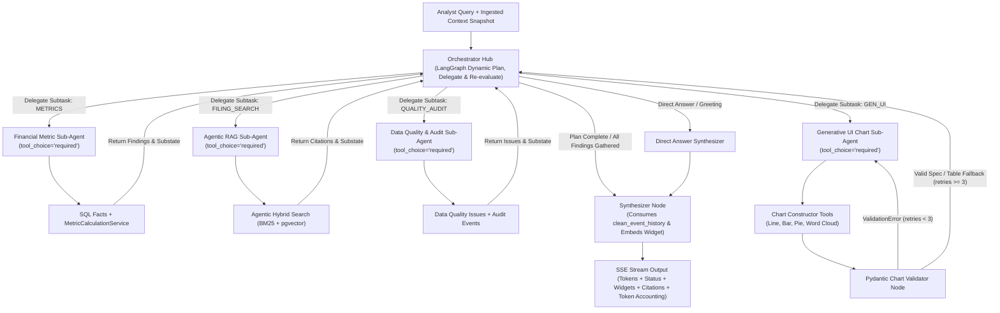

# AI Copilot Backend Architecture & Tools

The Underwriting Copilot is implemented as an orchestrated **LangGraph Hub-and-Spoke Multi-Agent StateGraph** leveraging **LangSmith prompt versioning & tracing**, deterministic calculation tools, agentic hybrid pgvector retrieval, isolated subagent substates, forced tool execution (`tool_choice="required"`), clean chronological event synthesis, and validated Generative UI chart widget generation.

## LangGraph Hub-and-Spoke Multi-Agent Architecture



## SSE Streaming Protocol
Endpoint: `POST /api/copilot/chat/stream`
Emits real-time event frames:
- `event: status` -> `{"step": "search", "message": "Searching FY2025 Debt Schedule for credit terms..."}`
- `event: token` -> `{"content": "Acme Corp reported net debt of €840M..."}`
- `event: widget` -> `{"widgetType": "chart", "spec": { ... validated Pydantic JSON ... }}`
- `event: citations` -> `[{"documentId": 2, "pageNumber": 42, "displayedPage": "p. 42", "boundingBox": [120, 340, 500, 480], "snippet": "..."}]`
- `event: trace` -> `{"run_id": "langsmith-run-uuid", "model": "gpt-4o"}`
- `event: done` -> `{"session_id": "...", "message_id": "...", "turn_count": 2, "token_usage": {"prompt_tokens": 1200, "completion_tokens": 350, "total_tokens": 1550}}`

---

# Copilot Tool Suite & Sub-Agent Schemas

All tools operate deterministically or through constrained SQL/pgvector queries with strict parameter injection (`company_id` is locked in graph state):

### 1. Financial Data & Deterministic Calculations (Financial Metric Sub-Agent)
Bound via `create_metric_tools(db)` with `tool_choice="required"`:
```python
get_current_metric(company_id: int, metric_name: str, fiscal_year: Optional[int]) -> Dict[str, Any]
get_company_metrics(company_id: int, fiscal_year: Optional[int]) -> Dict[str, Any]
get_metric_history(company_id: int, metric_name: str) -> Dict[str, Any]
get_fact_lineage(company_id: int, metric_name: str, fiscal_year: int) -> Dict[str, Any]
evaluate_formula(expression: str, variables: Dict[str, float]) -> Dict[str, Any]
```

### 2. Agentic Hybrid Document Retrieval & Text Analytics (Agentic RAG Sub-Agent)
Bound via `create_retrieval_tools(db)` with `tool_choice="required"`:
```python
search_filing_chunks_hybrid(
    query: str, 
    company_id: int, 
    fiscal_year: Optional[int] = None, 
    section_filter: Optional[str] = None, 
    dense_weight: float = 0.5,       # 1.0 = pure vector cosine, 0.0 = pure keyword BM25/tsvector
    keyword_query: Optional[str] = None,
    limit: int = 5                   # Agent dynamically tunes retrieval budget (1 to 100)
) -> Dict[str, Any]

get_page_content(document_id: int, page_number: int) -> Dict[str, Any]
count_concept_frequency(company_id: int, terms: List[str], document_id: Optional[int] = None) -> Dict[str, Any]
```

### 3. Data Quality & Audit Trail (Data Quality Sub-Agent)
Bound via `create_audit_tools(db)` with `tool_choice="required"`:
```python
get_unverified_facts(company_id: int) -> Dict[str, Any]
get_data_quality_issues(company_id: int) -> Dict[str, Any]
get_fact_audit_trail(fact_id: int) -> Dict[str, Any]
```

### 4. Generative UI Chart Constructors & Pydantic Validator (GenUI Sub-Agent)
Bound via `create_widget_tools()` with `tool_choice="required"`:
```python
build_line_chart_spec(
    title: str,
    series: List[Dict[str, str]],    # [{'key': 'leverage', 'label': 'Net Debt / EBITDA'}]
    data: List[Dict[str, Any]],      # [{'year': '2021', 'leverage': 3.10}, ...]
    description: Optional[str] = None,
    unit: Optional[str] = None
) -> LineChartSpec

build_bar_chart_spec(
    title: str,
    series: List[Dict[str, str]],
    data: List[Dict[str, Any]],
    description: Optional[str] = None,
    unit: Optional[str] = None
) -> BarChartSpec

build_pie_chart_spec(
    title: str,
    data: List[Dict[str, Any]],      # [{'name': 'Senior Notes', 'value': 650}, ...]
    description: Optional[str] = None,
    unit: Optional[str] = None
) -> PieChartSpec

build_word_cloud_spec(
    title: str,
    word_cloud_data: List[Dict[str, Any]], # [{'text': 'Covenants', 'value': 24}, ...]
    description: Optional[str] = None
) -> WordCloudSpec
```
* **Validation & Self-Correction Node**: Validates chart candidates against Pydantic schemas (`LineChartSpec`, `BarChartSpec`, `PieChartSpec`, `WordCloudSpec`). If `ValidationError` is encountered, exact field error messages are reflected back into `gen_ui` substate for up to 3 automatic correction retries before gracefully falling back to a `TableWidgetSpec`.

### 5. Grounded Citation & Evidence Provenance Schema
```python
class CitationSource(BaseModel):
    document_id: int
    filename: str
    page_number: int
    displayed_page: str
    section: Optional[str] = None
    snippet: Optional[str] = None
    bounding_box: Optional[List[float]] = None
    confidence_score: Optional[float] = None
    source_type: Literal["FILING_CHUNK", "STRUCTURED_FACT", "AUDIT_EVENT"]
```
All sources retrieved by any sub-agent are automatically tracked in the graph state's `retrieved_sources` registry and appended to the final response envelope for analyst inspection.

### 6. Subagent Substate Isolation & Clean Event Timeline Reducers
- **Substate Isolation (`SubagentSubstate`)**:
  Each subagent operates on its own dedicated substate (`task_description`, `iteration_count`, `max_iterations`, `tool_call_history`, `internal_messages`, `final_summary`). Tool failures are recorded with status `"ERROR"` so retry attempts avoid repeating malformed arguments.
- **Chronological Timeline (`clean_event_history`)**:
  Appends structured event entries (`USER_QUERY`, `ORCHESTRATOR_PLAN`, `DELEGATED_TASK`, `SUBAGENT_ANSWER`, `GEN_UI_SPEC`, `PLAN_REFINED`) via `append_clean_events`. The Synthesizer consumes this clean high-level narrative instead of raw tool payloads.
- **Token Accounting (`accumulate_tokens`)**:
  Merges prompt, completion, cached, reasoning, and total token usage across all graph nodes for cost tracking and LangSmith observability.

---

# RAG Architecture (Agentic Hybrid Search)

RAG complements structured retrieval through an **Agentic Hybrid Retrieval** strategy:

```text
User question
      ↓
Intent understanding
      ↓
 ┌────┴─────────────┐
 ↓                  ↓
Structured        Document
retrieval         retrieval
 ↓                  ↓
Postgres          pgvector
 ↓                  ↓
 └───────┬──────────┘
         ↓
      Evidence
         ↓
       LLM
         ↓
Answer + citations
```

For:

> "Why did leverage increase?"

the agent should retrieve both:

- Net debt history
- EBITDA history
- debt changes
- relevant filing text explaining the change

---

# Vector Metadata

Every chunk should contain metadata such as:

```text
company_id
document_id
document_type
fiscal_year
fiscal_period
page
section
financial_concepts
kpis
source_type
language
```

Example:

```text
company_id = ACME
fiscal_year = 2025
section = Debt and Financing
kpis = [net_debt, liquidity, leverage]
page = 104
```

This enables filtered retrieval.

---

# Credit Rating Methodology

Use rating bands rather than a numeric score.

Example:

```text
AAA
AA
A
BBB
BB
B
CCC
```

The exact thresholds should be explicitly configurable.

For example:

```text
Net Debt / EBITDA
< 1.0x       → positive
1.0–2.0x     → strong
2.0–3.0x     → moderate
3.0–4.0x     → elevated
> 4.0x       → weak
```

Similar rules can be defined for:

- interest coverage
- liquidity
- FCF
- profitability
- debt trend

The rating engine produces:

```text
Suggested Rating: BB

Primary drivers:
- Elevated leverage
- Weakening interest coverage
- Negative FCF
- Adequate liquidity
```

The UI should explicitly say:

> **AI-assisted suggested rating — analyst judgment required**

---

# KPI Categories

The dashboard should use category tabs.

## Profitability

| KPI            | Formula                                   |
| -------------- | ----------------------------------------- |
| Revenue        | Reported revenue                          |
| Revenue Growth | `(Revenue_t - Revenue_t-1) / Revenue_t-1` |
| Gross Margin   | `Gross Profit / Revenue`                  |
| EBITDA         | Reported EBITDA                           |
| EBITDA Margin  | `EBITDA / Revenue`                        |
| EBIT           | Reported EBIT                             |
| Net Income     | Reported net income                       |

## Leverage

| KPI               | Formula                              |
| ----------------- | ------------------------------------ |
| Total Debt        | Short-term debt + long-term debt     |
| Net Debt          | Total Debt - Cash                    |
| Debt / EBITDA     | `Total Debt / EBITDA`                |
| Net Debt / EBITDA | `Net Debt / EBITDA`                  |
| Debt / Capital    | `Total Debt / (Total Debt + Equity)` |

## Coverage

| KPI                  | Formula                                  |
| -------------------- | ---------------------------------------- |
| EBITDA / Interest    | `EBITDA / Interest Expense`              |
| EBIT / Interest      | `EBIT / Interest Expense`                |
| Cash Flow / Interest | `Operating Cash Flow / Interest Expense` |

## Liquidity

| KPI                    | Formula                                                               |
| ---------------------- | --------------------------------------------------------------------- |
| Cash                   | Reported cash and equivalents                                         |
| Current Ratio          | `Current Assets / Current Liabilities`                                |
| Quick Ratio            | `(Cash + Short-term Investments + Receivables) / Current Liabilities` |
| Working Capital        | `Current Assets - Current Liabilities`                                |
| Short-term Debt / Cash | `Short-term Debt / Cash`                                              |

## Cash Flow

| KPI                 | Formula                       |
| ------------------- | ----------------------------- |
| Operating Cash Flow | Reported operating cash flow  |
| Capex               | Capital expenditure           |
| Free Cash Flow      | `Operating Cash Flow - Capex` |
| FCF / Debt          | `Free Cash Flow / Total Debt` |

## Balance Sheet

| KPI                 | Formula                                |
| ------------------- | -------------------------------------- |
| Total Assets        | Reported total assets                  |
| Equity              | Reported shareholders' equity          |
| Debt                | Total debt                             |
| Net Working Capital | `Current Assets - Current Liabilities` |

In the current state it is fair to hardcode all of these formulas in the backend
without any versioning.

---

---

# LangSmith

Use LangSmith to trace:

- extraction calls
- structured-output parsing
- Copilot calls
- retrieval
- tool calls
- prompts
- model versions
- latency
- token usage
- failed runs

The application should attach:

```text
company_id
document_id
filing_year
user_id
chat_session_id
correlation_id
```

as trace metadata.

---

# Security

Even though the demo uses fictional companies, implement production-like
controls.

Minimum:

- session management
- secrets outside source code
- audit logging

Never allow the frontend to construct arbitrary database queries.

---

# Error Handling

The system should explicitly distinguish:

```text
Missing
Ambiguous
Unverified
Verified
Corrected
Calculation unavailable
Source unavailable
```

Example:

```text
Interest Coverage
N/A

Reason:
Interest expense could not be reliably extracted
from the filing.
```

Never silently substitute zero.

---

# Evaluation

The system should be evaluated separately at each layer.

## Extraction

Did we extract the correct value?

## Provenance

Can we identify the exact source?

## Normalization

Did the fact map to the correct ontology concept?

## Calculation

Did the KPI formula produce the correct value?

## Retrieval

Did the correct filing evidence get retrieved?

## Copilot

Did the answer use the correct evidence?

## Rating

Did the suggested rating follow the documented methodology?

This decomposition makes debugging dramatically easier.

---
