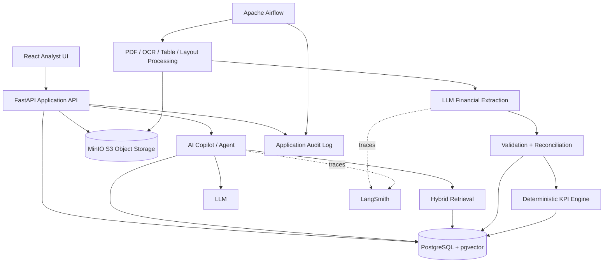

# AI-Assisted Credit Underwriting Platform

## Product Requirements, Architecture & Implementation Plan

**Status:** Draft **Product:** Fictional Bank — AI-Assisted Credit Underwriting
Workstation **Primary user:** Financial Analyst / Credit Analyst **Target:**
Production-like demonstrator

---

# Executive Summary

The product is an AI-assisted credit underwriting workstation for financial
analysts.

An analyst selects a company and reviews its financial filings. The system
automatically extracts relevant financial information from filings, stores each
interpreted financial fact together with strong source lineage, calculates
standardized underwriting KPIs, presents historical trends, and provides an AI
copilot that can reason over both structured financial data and the original
filing evidence.

The system must distinguish clearly between:

1. **Raw evidence** — immutable source material extracted from filings.
2. **Financial facts** — interpreted values derived from the evidence and
   potentially corrected by an analyst.
3. **Derived analytics** — deterministic calculations based on financial facts.
4. **Credit assessment** — a suggested rating derived from the analytics and
   accompanied by an AI-generated explanation.

The analyst must never need SQL knowledge to correct an extracted fact.

Every important number shown in the application must be traceable back to the
evidence that produced it.

---

# Product Vision

The application should feel like a modern institutional credit analyst
workstation rather than an AI chatbot.

The primary workflow is:

```text
Select company
     ↓
Review latest financial position
     ↓
Understand historical development
     ↓
Investigate risk KPIs
     ↓
Trace metrics to filing evidence
     ↓
Correct/verify questionable facts
     ↓
Observe recalculated analytics
     ↓
Review suggested credit rating
     ↓
Ask AI Copilot for explanations
     ↓
Make underwriting decision
```

The AI should augment the analyst rather than replace the analyst.

The system should therefore favor:

- traceability over magic
- deterministic calculations over LLM arithmetic
- editable data over immutable AI output
- evidence over unsupported explanations
- explicit methodology over opaque scoring

---

# Goals

## Primary goals

### G1 — Financial data extraction

Automatically extract relevant financial facts from PDF filings.

### G2 — Strong provenance

Every extracted financial fact must retain its source document, filing period,
page and source location.

### G3 — Historical analysis

Allow analysts to understand how financial performance and credit risk changed
over time.

### G4 — Deterministic analytics

Calculate underwriting KPIs from normalized financial facts rather than asking
an LLM to calculate them.

### G5 — Analyst correction

Allow analysts to correct or verify extracted facts without SQL.

### G6 — Explainable rating suggestion

Provide a rating-band suggestion with an AI explanation of the main drivers.

### G7 — AI Copilot

Allow analysts to ask questions about the current company, its financial
history, KPIs and filing evidence.

### G8 — Auditability

Maintain a complete history of extracted values, analyst corrections, derived
calculations and relevant AI interactions.

---

# Non-Goals

For the initial version:

- The system is not an autonomous credit decision maker.
- The suggested rating is not a regulatory or legally binding credit rating.
- The system does not replace a human underwriting committee.
- The system does not need to integrate with real banking systems.
- The system does not require a real external credit-rating agency methodology.
- The system does not need real-time financial market data.
- The system does not need a separate data warehouse.
- The system does not need a separate time-series database.
- The system does not need a dedicated vector database initially.

# Architecture

The architectural details of the application are split into seperate PRD files
depending on the aspect of the architecture they impact:

- UI_PRD.md: Covers the frontend architecture
- BACKEND_PRD.md: Covers the backend architecture
- DATA_PIPELINE_PRD.md: Covers the data pipeline and PDF processing architecture
- STORAGE_PRD.md: Covers the the storage services needed and the architecture of
  the storage



---

# Logical Architecture

## Presentation layer

```text
React
TypeScript
Tailwind
Component library
Charts
```

Responsibilities:

- dashboard
- KPI charts
- document viewer
- source navigation
- corrections
- Copilot

## Application layer

FastAPI.

Responsibilities:

- company API
- KPI API
- history API
- correction API
- source/evidence API
- Copilot API

## Domain layer

Python services:

```text
FinancialFactService
MetricCalculationService
RatingService
EvidenceService
ReconciliationService
CompanyService
```

## Data layer

PostgreSQL:

```text
companies
documents
source_locations
financial_concepts
financial_facts
financial_fact_versions
metric_definitions
derived_metric_values
rating_assessments
corrections
audit_events
chat_sessions
chat_messages
document_chunks
embeddings
```

MinIO:

```text
PDFs
page images
OCR artifacts
processed documents
```

---

# Recommended Technology Stack

| Area                | Recommended                         |
| ------------------- | ----------------------------------- |
| Frontend            | React + TypeScript                  |
| UI                  | Tailwind + component library        |
| Charts              | Apache ECharts or Recharts          |
| Backend             | Python + FastAPI                    |
| Database            | PostgreSQL                          |
| Vector search       | pgvector                            |
| Object storage      | MinIO                               |
| Orchestration       | Apache Airflow                      |
| PDF processing      | PyMuPDF + table/layout extraction   |
| OCR                 | OCR fallback                        |
| LLM extraction      | Structured-output capable LLM       |
| Embeddings          | Embedding model                     |
| Agent orchestration | LangGraph                           |
| LLM tracing         | LangSmith                           |
| Deployment          | Docker Compose initially            |
| Testing             | Pytest + frontend testing framework |

Do not introduce a separate time-series database or vector database for the MVP.

PostgreSQL + pgvector is enough.

---

# Architectural Principles

The following should be treated as non-negotiable engineering principles.

### Principle 1

**Never ask the LLM to perform deterministic financial calculations.**

### Principle 2

**Never store an important financial number without provenance.**

### Principle 3

**Never overwrite financial facts. Version them.**

### Principle 4

**Derived analytics are calculated from facts, not manually edited.**

### Principle 5

**Every derived metric knows which fact versions produced it.**

### Principle 6

**Financial periods and database timestamps are separate concepts.**

### Principle 7

**The Copilot uses tools to retrieve financial truth.**

### Principle 8

**RAG provides evidence; it does not replace structured financial data.**

### Principle 9

**Analyst corrections are first-class domain events.**

### Principle 10

**The rating is a suggestion, not an autonomous decision.**

### Principle 11

**LangSmith is AI observability, not the business audit system.**

### Principle 12

**The original filing remains immutable.**

If additional information on the architecture is needed please read the other
PRD files in this directory:

- UI_PRD.md: Covers the frontend architecture
- BACKEND_PRD.md: Covers the backend architecture
- DATA_PIPELINE_PRD.md: Covers the data pipeline and PDF processing architecture
- STORAGE_PRD.md: Covers the the storage services needed and the architecture of
  the storage
