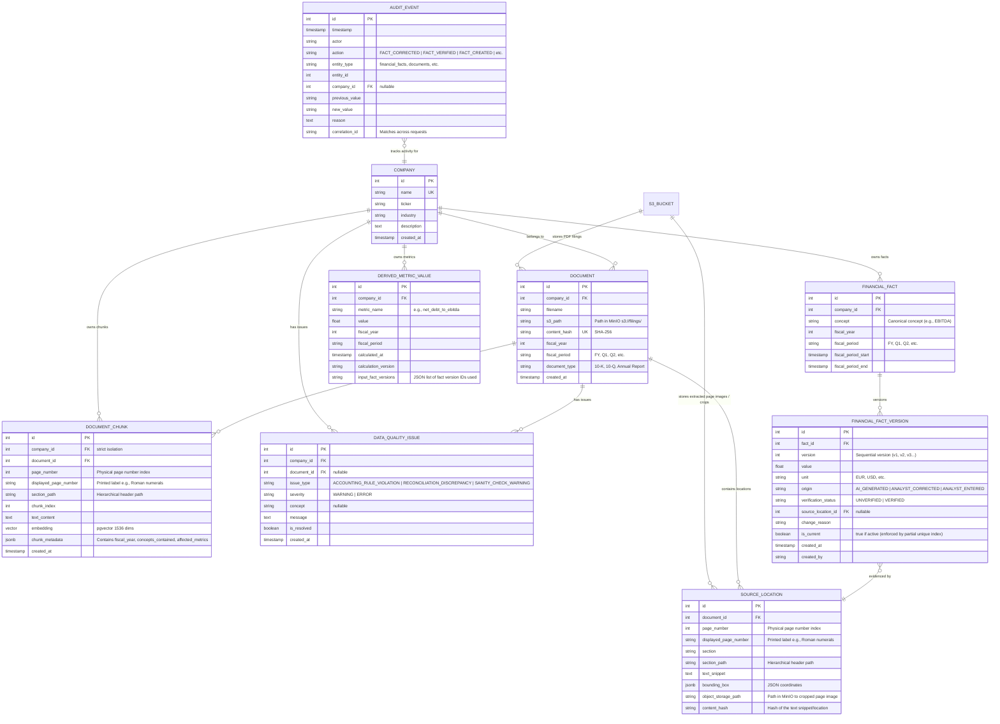

# Core Domain Model

The most important architectural decision is to distinguish:

```text
RAW EVIDENCE
     ↓
FINANCIAL FACT
     ↓
DERIVED ANALYTIC
     ↓
CREDIT ASSESSMENT
```

These layers must not be collapsed.

---

# Raw Evidence

Raw evidence is immutable.

It represents what was actually found in the filing.

Examples:

- Original PDF
- PDF page
- OCR text
- extracted text
- table
- image
- bounding box
- source snippet

Documents should be stored in S3-compatible object storage.

For the local Docker Compose environment, use an S3-compatible service such as
MinIO.

Example:

```text
s3://filings/
    acme-corp/
        2025/
            annual-report.pdf
        2024/
            annual-report.pdf
```

PostgreSQL stores the metadata and references to these objects.

A `SourceLocation` should contain information such as:

```text
source_document_id
page_number
text
bounding_box
section
object_storage_path
content_hash
```

The frontend should be able to navigate from a KPI directly to this evidence.

---

# Financial Facts

A FinancialFact represents an interpreted financial value.

Example:

```text
Metric: EBITDA
Value: 178,000,000
Currency: EUR
Fiscal Year: 2025
```

But the fact should also contain its lineage.

Conceptually:

```text
FinancialFact
├── company
├── financial_concept
├── value
├── unit
├── currency
├── fiscal_period
├── source_document
├── source_location
├── extraction_method
├── extraction_model
├── verification_status
├── version
└── timestamps
```

A fact should never exist without provenance unless it has explicitly been
marked as an analyst-created value.

---

# Verification Status

Do not use numeric confidence scores.

Use a simple state:

```text
UNVERIFIED
VERIFIED
```

Additional state information can distinguish:

```text
AI_GENERATED
ANALYST_CORRECTED
ANALYST_ENTERED
```

For example:

```text
status = VERIFIED
origin = ANALYST_CORRECTED
```

means:

> The original value was generated by AI, but the analyst has reviewed/corrected
> it and the current value is considered verified.

Missing values should remain explicitly missing rather than being guessed.

---

# Financial Fact Versioning

Financial facts must be versioned.

Do not overwrite history.

Example:

```text
FinancialFact
    ├── version 1
    │     EBITDA = €178m
    │     origin = AI
    │     status = UNVERIFIED
    │
    └── version 2
          EBITDA = €184m
          origin = ANALYST_CORRECTED
          status = VERIFIED
```

The application should identify one version as the current active version.

This can be implemented with an append-only version table:

```text
financial_fact
financial_fact_version
```

The parent `financial_fact` represents the conceptual fact.

The version table contains its historical states.

Each version should have:

```text
id
financial_fact_id
value
unit
currency
source_location_id
origin
verification_status
created_at
created_by
change_reason
is_current
```

A database constraint should ensure that only one version is current.

---

# How Corrections Cascade Into Derived Analytics

This is one of the most important implementation details.

Do **not** store derived metrics as independently editable values.

Instead, define every derived metric as a deterministic expression over
financial facts.

For example:

```text
Net Debt = Total Debt - Cash

Net Debt / EBITDA = Net Debt / EBITDA
```

Suppose:

```text
Debt = €1,200m
Cash = €360m
EBITDA = €178m
```

The system calculates:

```text
Net Debt = 840m
Net Debt / EBITDA = 4.72x
```

The analyst changes EBITDA:

```text
€178m → €184m
```

The system does not need an LLM.

It simply invalidates/recalculates the dependent analytics:

```text
EBITDA changed
    ↓
Net Debt / EBITDA dependency detected
    ↓
recalculate
    ↓
840 / 184
    ↓
4.57x
```

## Recommended implementation

Create a `MetricDefinition` table.

Example:

```text
MetricDefinition
------------------------------
metric_id
name
formula
version
required_concepts
unit
category
```

Conceptually:

```text
Net Debt / EBITDA

inputs:
    total_debt
    cash
    EBITDA

formula:
    (total_debt - cash) / EBITDA
```

The backend can compile these definitions into deterministic calculations.

For a demo, the formulas can be implemented as typed Python functions rather
than building a general-purpose formula language.

Example:

```text
calculate_net_debt(debt, cash)

calculate_net_debt_to_ebitda(net_debt, ebitda)

calculate_ebitda_margin(ebitda, revenue)
```

This is safer than allowing arbitrary formulas.

## Dependency graph

The analytics layer should maintain a dependency relationship:

```text
Revenue ───────────────┐
                       ↓
                   EBITDA Margin
                       ↑
EBITDA ────────────────┘

Debt ──────────────┐
                   ↓
                 Net Debt ──────┐
Cash ──────────────┘            ↓
                            Net Debt /
EBITDA ────────────────────── EBITDA
```

When a fact changes, the system identifies all affected derived metrics

For the MVP, this can be handled synchronously in the application.

For larger workloads, the same dependency graph can generate recalculation jobs.

---

# Snapshotting Derived Analytics

Although derived analytics are reproducible, I recommend storing calculation
snapshots.

For example:

```text
DerivedMetricValue
------------------------------
metric_definition_id
company_id
financial_period_id
value
calculated_at
calculation_version
input_fact_versions
```

This provides two benefits:

1. Historical reproducibility.
2. The ability to explain exactly which fact versions produced a number.

Example:

```text
Net Debt / EBITDA = 4.72x

Inputs:
Debt v3
Cash v2
EBITDA v1

Calculation version:
metric-definition-v1
```

After the correction:

```text
Net Debt / EBITDA = 4.57x

Inputs:
Debt v3
Cash v2
EBITDA v2
```

This is extremely valuable for auditability.

---

# Historical Data

PostgreSQL is sufficient.

A separate time-series database is not necessary.

The financial data is naturally relational:

```text
Company
Financial Period
Financial Fact
Metric
```

Use fiscal periods as the primary historical dimension.

Example:

```text
company_id
fiscal_year
fiscal_period
fact_id
value
```

---

# Timestamps vs Financial Periods

Do not use database timestamps to represent financial history.

These are different concepts.

A fact should have:

```text
fiscal_period_start
fiscal_period_end
fiscal_year
fiscal_quarter
```

and separately:

```text
created_at
updated_at
verified_at
```

For example:

```text
Revenue
Fiscal period: 2025-01-01 → 2025-12-31

created_at:
2026-08-15 12:32

verified_at:
2026-08-15 14:21
```

The first describes **when the financial value applies**.

The second describes **when the system/user processed it**.

This distinction is essential.

---

---

# Suggested PostgreSQL Model

Below is the visual Entity Relationship (ER) diagram illustrating the relationships between the database tables and their connection to S3 storage buckets.



## Database Schema Design Decisions

1. **Document Ingestion & Deduplication**: Each unique document hash corresponds to a single `Document` entry. Re-uploading an identical document will not duplicate the record or re-trigger extraction.
2. **Metadata Optimization**: Company description and industry fields are stored directly in the `companies` table.
3. **Fiscal Period Synchronization**: Document entries carry `fiscal_year`, `fiscal_period`, and `document_type` to represent the financial context of the filing.

4. **Source Location Crops**: `SourceLocation` includes `object_storage_path` to reference cropped images or page images in S3 (MinIO) and `content_hash` to uniquely verify the source content. Bounding boxes are stored as PostgreSQL `JSONB` for simplicity and extensibility.
5. **Separation of Periods**: Financial facts explicitly store `fiscal_period_start` and `fiscal_period_end` timestamps to distinguish when the financial value applies from when the database record was written.
6. **Append-Only Fact Versioning**:
   - `FinancialFactVersion` tracks historical changes with an explicit `version` integer column incrementing sequentially (v1, v2, v3...).
   - A partial unique index constraint guarantees that only one version is current (`is_current = true`) per `fact_id` at any time.
   - The active version must always be the latest version with the highest version number.
7. **Workflow Constraints**: `origin` and `verification_status` columns are managed using PostgreSQL standard `VARCHAR` columns with database-level check constraints.
8. **Decoupled Architecture**: Database connection pooling, session creation, and the `get_db` FastAPI dependency are isolated in a separate `database.py` service.
9. **Automatic Migrations**: Database migrations are managed via Alembic inside `apps/api` and run automatically on API startup (as well as manually via `uv`).

---

# Time-Series Architecture

PostgreSQL should handle the MVP.

A historical query is straightforward:

```sql
SELECT
    fiscal_year,
    value
FROM derived_metric_values
WHERE company_id = :company
  AND metric_definition_id = :metric
ORDER BY fiscal_year;
```

No time-series database is required.

The important thing is proper modeling:

```text
fiscal_period
    ≠
created_at
```

Use fiscal periods for financial history.

Use timestamps for:

- ingestion
- extraction
- verification
- correction
- calculation
- audit events

A separate TimescaleDB installation should only be considered if the product
later gains high-frequency market/operational data. It adds little value for
annual financial filings.

# Auditability

Use a dedicated audit event table.

Example:

```text
AuditEvent
----------------------------
timestamp
actor
action
entity_type
entity_id
company_id
previous_value
new_value
reason
correlation_id
```

Examples:

```text
FACT_CREATED
FACT_CORRECTED
FACT_VERIFIED
METRIC_RECALCULATED
RATING_GENERATED
DOCUMENT_PROCESSED
DOCUMENT_REPROCESSED
```

LangSmith is complementary.

LangSmith answers:

> What did the AI do?

The application audit log answers:

> What happened to the financial data?

---

# Copilot Chat History & Session Storage

To support multi-session conversations, auditability, and past chat switching, Copilot sessions and messages are persisted in PostgreSQL.

### Relational Schema

```sql
CREATE TABLE chat_sessions (
    id UUID PRIMARY KEY DEFAULT gen_random_uuid(),
    company_id INTEGER REFERENCES companies(id) ON DELETE CASCADE,
    title VARCHAR(255) NOT NULL,
    is_active BOOLEAN NOT NULL DEFAULT TRUE,
    created_at TIMESTAMP WITH TIME ZONE DEFAULT timezone('utc'::text, now()) NOT NULL,
    updated_at TIMESTAMP WITH TIME ZONE DEFAULT timezone('utc'::text, now()) NOT NULL
);

CREATE INDEX idx_chat_sessions_company_id ON chat_sessions(company_id);

CREATE TABLE chat_messages (
    id UUID PRIMARY KEY DEFAULT gen_random_uuid(),
    session_id UUID NOT NULL REFERENCES chat_sessions(id) ON DELETE CASCADE,
    role VARCHAR(50) NOT NULL, -- 'user' | 'assistant' | 'system'
    content TEXT NOT NULL,
    tool_calls JSONB,           -- List of executed tool names & args
    citations JSONB,            -- List of document citations (page, bbox, snippet)
    widgets JSONB,              -- Structured Generative UI widget specs (charts, tables)
    context_snapshot JSONB,     -- UI context at invocation (active KPI, active doc/page)
    created_at TIMESTAMP WITH TIME ZONE DEFAULT timezone('utc'::text, now()) NOT NULL
);

CREATE INDEX idx_chat_messages_session_id ON chat_messages(session_id);
```

