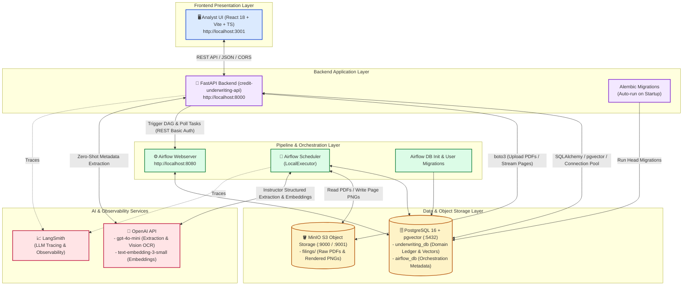
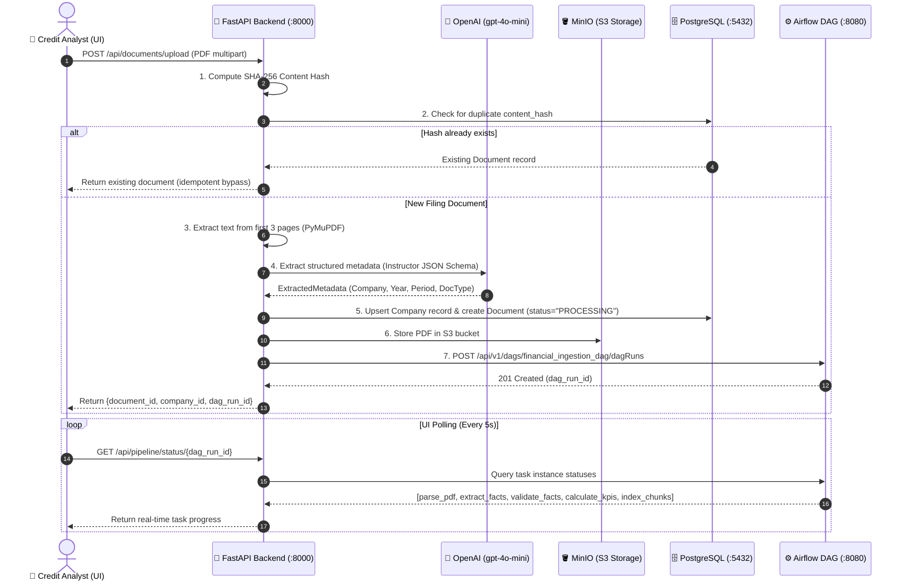
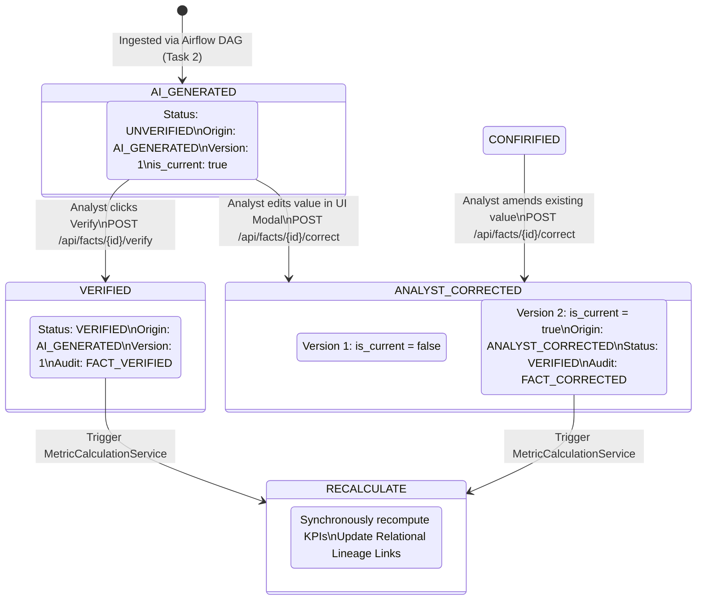
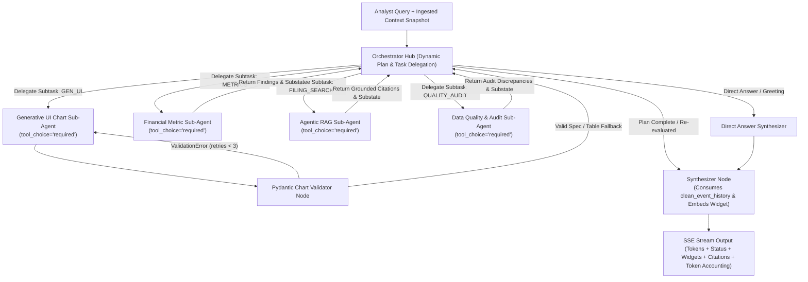

# 🏦 AI-Assisted Credit Underwriting Platform

> An institutional-grade, AI-assisted credit underwriting workstation for
> corporate financial analysts. Ingests corporate 10-K/10-Q financial filings,
> extracts financial facts with spatial bounding-box provenance, validates
> accounting invariants, computes standardized credit KPIs deterministically,
> provides an interactive audit & correction workspace, and grounds an AI
> Underwriting Copilot with hybrid RAG.

---

## 📋 Table of Contents

- [🌟 Executive Summary & Vision](#-executive-summary--vision)
- [🏛️ System Architecture](#️-system-architecture)
- [📦 Core Service Components](#-core-service-components)
  - [1. Analyst Frontend UI (`apps/analyst_ui`)](#1-analyst-frontend-ui-appsanalyst_ui)
  - [2. Backend Application API (`apps/api`)](#2-backend-application-api-appsapi)
  - [3. Ingestion & Extraction Pipelines (`apps/pipelines`)](#3-ingestion--extraction-pipelines-appspipelines)
  - [4. Storage & Database Layer](#4-storage--database-layer)
- [🔄 Core Business & Technical Workflows](#-core-business--technical-workflows)
  - [Workflow 1: Intelligent Filing Ingestion & Pipeline Orchestration](#workflow-1-intelligent-filing-ingestion--pipeline-orchestration)
  - [Workflow 2: Fact Versioning, Verification & Audit Trails](#workflow-2-fact-versioning-verification--audit-trails)
  - [Workflow 3: Deterministic KPI Engine & Relational Lineage](#workflow-3-deterministic-kpi-engine--relational-lineage)
  - [Workflow 4: Hub-and-Spoke Multi-Agent Credit Underwriting Copilot](#workflow-4-hub-and-spoke-multi-agent-credit-underwriting-copilot)
- [⚙️ Prerequisites & Environment Setup](#️-prerequisites--environment-setup)
- [🚀 Quickstart (Docker Compose)](#-quickstart-docker-compose)
  - [Service Access Endpoints](#service-access-endpoints)
- [🛠️ Local Development & Running Services Individually](#️-local-development--running-services-individually)
- [🧪 Testing & Quality Assurance](#-testing--quality-assurance)
- [📁 Repository Structure](#-repository-structure)
- [📚 Architectural Principles & PRD References](#-architectural-principles--prd-references)

---

## 🌟 Executive Summary & Vision

Traditional financial spreading and corporate credit underwriting are manually
intensive, error-prone, and slow. While Large Language Models (LLMs) offer
breakthrough document understanding capabilities, they cannot be trusted with
black-box financial arithmetic or unaudited figures.

This platform bridges the gap by functioning as a **traceable, human-in-the-loop
credit underwriting workstation**:

- **Evidence First**: Every financial metric is traceable down to the exact PDF
  page, section breadcrumb, and pixel bounding box.
- **Deterministic Math**: Financial KPIs (Leverage, Coverage, Profitability,
  Liquidity) are calculated deterministically via canonical accounting
  formulas—never by LLM arithmetic.
- **Bi-Temporal Versioning**: Extracted facts are never overwritten; analyst
  corrections create immutable audit versions and trigger immediate reactive
  recalculation of dependent metrics.
- **AI Copilot Grounding**: Conversational AI is grounded on structured
  financial facts, database metrics, and pgvector semantic chunks.

```text
[ Upload 10-K / 10-Q PDF ]
           ↓
[ Airflow: Parse Layout & Render Pages ]
           ↓
[ LLM: Extract Canonical Facts + Source Coordinates ]
           ↓
[ Accounting Validation & Sanity Invariant Checks ]
           ↓
[ Deterministic KPI Engine + Relational Lineage Graph ]
           ↓
[ Interactive Analyst Workstation: Review, Trace, Correct & Assess ]
```

---

## 🏛️ System Architecture

The application is built as a microservices architecture orchestrated via
[docker-compose.yml](docker-compose.yml):



---

## 📦 Core Service Components

| Subsystem                  | Service Name                              | Tech Stack                                              | Documentation Link                             | Description                                                                                                                                                                                                                               |
| :------------------------- | :---------------------------------------- | :------------------------------------------------------ | :--------------------------------------------- | :---------------------------------------------------------------------------------------------------------------------------------------------------------------------------------------------------------------------------------------- |
| **Frontend**               | `analyst-ui`                              | React 18, TypeScript, Vite, TailwindCSS, Recharts       | [Analyst UI README](apps/analyst_ui/README.md) | MVC-based financial analyst workstation featuring dynamic KPI grids, sparklines, click-to-source provenance drawer, zero-SQL fact correction modal, live Airflow upload progress monitor, and AI Copilot sidebar.                         |
| **Backend API**            | `api`                                     | Python 3.12, FastAPI, SQLAlchemy 2.0, Pydantic, Alembic | [API Service README](apps/api/README.md)       | Central orchestration layer handling document upload validation, SHA-256 deduplication, zero-shot metadata extraction, deterministic 6-category KPI engine, bi-temporal fact versioning, PDF page caching, and Airflow REST dispatching.  |
| **Data Pipelines**         | `airflow-webserver` / `airflow-scheduler` | Apache Airflow 2.x, PyMuPDF, Instructor, pgvector       | [Pipelines README](apps/pipelines/README.md)   | 5-step DAG (`financial_ingestion_dag`) executing document layout parsing, page PNG rendering, LLM structured fact extraction, mathematical accounting rule validation, derived metric computation, and parallel semantic chunk embedding. |
| **Relational & Vector DB** | `postgres`                                | PostgreSQL 16 + pgvector                                | [Storage PRD](PRDs/STORAGE_PRD.md)             | Primary relational database storing companies, documents, source locations, financial facts, immutable version history, KPI definitions, calculation snapshots, audit logs, and 1536-dimensional embeddings.                              |
| **Object Storage**         | `minio` & `minio-init`                    | MinIO (S3-compatible)                                   | [Storage PRD](PRDs/STORAGE_PRD.md)             | Dedicated S3 object storage for raw corporate filing PDFs and rendered 150 DPI page PNGs for interactive UI viewing.                                                                                                                      |

---

### 1. Analyst Frontend UI (`apps/analyst_ui`)

- **Architecture**: Model-View-Controller (MVC) design pattern using custom
  React hooks as state machines.
- **Key Modules**:
  - `CompanyBanner`: Displays selected company, financial period, credit rating
    badge (`BB`, `A`, `B`), risk level, and verified data quality percentage.
  - `KPICategoryTabs` & `KPIGrid`: Categorized credit metrics (Profitability,
    Leverage & Debt, Liquidity, Coverage & Cash Flow, Growth) with YoY delta
    badges, formatting helpers, and sparklines.
  - `KPIDetailDrawer`: Click-to-source inspection drawer displaying historical
    Recharts trends, exact mathematical formula breakdowns, cited
    `FinancialFactVersion` records, and document breadcrumbs.
  - `DataCorrectionModal`: In-app analyst override modal with audit
    justification logging and real-time feedback on all recalculated dependent
    metrics.
  - `UploadView`: Drag-and-drop filing upload with live 5-second polling of
    Airflow DAG task instance states.
  - `CopilotPanel`: AI Underwriting Copilot grounded on database metrics and RAG
    citations.

👉 _Read the full [Analyst UI README](apps/analyst_ui/README.md) for sequence
diagrams, model mappings, and controller state architecture._

---

### 2. Backend Application API (`apps/api`)

- **Key Services**:
  - `MetadataExtractionService`: Uses `instructor` with `gpt-4o-mini` on the
    first 3 pages of an uploaded PDF to detect company name, ticker, fiscal
    year, period, and document type.
  - `StorageService`: S3 integration managing raw PDF uploads and rendered page
    PNG retrieval.
  - `AirflowService`: HTTP client interfacing with the Airflow 2.x REST API to
    trigger DAG runs and poll execution states.
  - `MetricCalculationService`: Synchronizes the canonical
    [Metric Registry](apps/api/src/api/core/metric_registry.py), aggregates
    normalized facts, calculates deterministic formulas, and inserts relational
    lineage records into `derived_metric_input_facts`.
  - `FactVerificationService`: Manages verification statuses, increments version
    counters for analyst overrides, and logs `AuditEvent` records.
  - `PDF Page Streaming`: Serves cached page PNGs or falls back to on-the-fly
    PyMuPDF rendering.

👉 _Read the full [Backend API README](apps/api/README.md) for REST API
specifications, database ER diagrams, and endpoint listings._

---

### 3. Ingestion & Extraction Pipelines (`apps/pipelines`)

- **DAG Definition**: `financial_ingestion_dag`
  ([dags/financial_ingestion_dag.py](apps/pipelines/dags/financial_ingestion_dag.py))
- **5-Step Execution Topology**:
  1. `parse_pdf`: PyMuPDF layout analysis, bounding box extraction
     `[x0, y0, x1, y1]`, header/footer noise removal, 150 DPI page rendering to
     MinIO, with OpenAI Vision OCR fallback for scanned pages.
  2. `extract_facts`: `instructor` structured LLM extraction for 20+ canonical
     financial concepts, automatic unit scaling, and `SourceLocation`
     persistence.
  3. `validate_facts`: Accounting balance invariants
     ($\text{Assets} \equiv \text{Liabilities} + \text{Equity}$), financial
     sanity checks (non-negative revenue/cash), and prior-year cross-document
     reconciliation.
  4. `calculate_kpis`: Recalculates full credit underwriting metric suite and
     updates relational lineage links.
  5. `index_chunks` _(Parallel branch)_: Sliding-window chunking (1000 chars,
     150 overlap), breadcrumb enrichment, and OpenAI `text-embedding-3-small`
     vector indexing into `document_chunks` with `pgvector`.

👉 _Read the full [Pipelines README](apps/pipelines/README.md) for task inputs,
XCom outputs, and validation rules._

---

### 4. Storage & Database Layer

- **PostgreSQL 16 with pgvector**:
  - `underwriting_db`: Primary application ledger with partial unique
    constraints (`ix_fact_versions_current_uniq`) ensuring exactly one active
    version per fact, relational metric calculation lineages, and persisted
    multi-session Copilot chat sessions & messages (`chat_sessions`, `chat_messages`).
  - `airflow_db`: Dedicated schema/database isolating Airflow metadata.
- **MinIO S3**:
  - `filings` bucket:
    - Raw PDFs:
      `filings/{company_id}/{fiscal_year}_{fiscal_period}/{document_type}_{hash}.pdf`
    - Rendered Page PNGs: `pages/{document_id}/page_{page_number}.png`

---

## 🔄 Core Business & Technical Workflows

### Workflow 1: Intelligent Filing Ingestion & Pipeline Orchestration



---

### Workflow 2: Fact Versioning, Verification & Audit Trails

Facts are never overwritten in-place. If an analyst modifies an extracted value
or confirms an AI-generated fact, the platform logs an immutable `AuditEvent`
and manages active versions:



---

### Workflow 3: Deterministic KPI Engine & Relational Lineage

Derived metrics are computed deterministically from canonical facts and linked
in `derived_metric_input_facts`:

```mermaid
flowchart LR
    subgraph Facts["Active Financial Facts (is_current=True)"]
        F1["Total Debt: €840M"]
        F2["Cash: €140M"]
        F3["EBITDA: €178M"]
        F4["Revenue: €1,250M"]
        F5["Operating Income: €210M"]
    end

    subgraph CalculationEngine["MetricCalculationService"]
        Formula["Formula: (Total Debt - Cash) / EBITDA\nNet Debt / EBITDA = (€840M - €140M) / €178M"]
    end

    subgraph Result["DerivedMetricValue Snapshot"]
        Metric["Net Debt / EBITDA: 3.93x\nCategory: Leverage\nStatus: Elevated Risk"]
    end

    subgraph Provenance["Relational Evidence Lineage"]
        L1["Cited Fact: Total Debt (v1) &rarr; Page 42, Table 3, BBox: [54, 120, 500, 140]"]
        L2["Cited Fact: Cash (v2, Analyst Corrected) &rarr; Page 40, Note 2"]
        L3["Cited Fact: EBITDA (v1) &rarr; Page 45, Income Statement"]
    end

    Facts --> CalculationEngine
    CalculationEngine --> Result
    Result --- Provenance
```



---

### Workflow 4: Hub-and-Spoke Multi-Agent Credit Underwriting Copilot

The AI Underwriting Copilot orchestrates specialized subagents over a **LangGraph Hub-and-Spoke StateGraph** with forced tool execution (`tool_choice="required"`), isolated subagent substates, clean chronological event synthesis, and dynamic replanning:



---

## ⚙️ Prerequisites & Environment Setup

### Required Tools

1. **Docker & Docker Desktop** (Docker Engine 24+, Docker Compose v2+)
2. **Python 3.12+**
3. **[uv](https://github.com/astral-sh/uv)** (Fast Python package and
   environment manager)
4. **Node.js 18+ & npm** _(Only needed if developing the frontend outside
   Docker)_

### 1. Environment Configuration

Copy the example environment template to `.env`:

```bash
cp env.example .env
```

Open `.env` and fill in your API keys:

```env
# Required for structured LLM fact extraction, metadata resolution, Vision OCR, and embeddings
OPENAI_API_KEY=sk-your-openai-api-key-here

# Optional: LangSmith Observability & Tracing
LANGSMITH_API_KEY=your_langsmith_api_key
LANGSMITH_TRACING=true
LANGSMITH_ENDPOINT=https://api.smith.langchain.com
LANGSMITH_PROJECT="e2e-ai-eng"

# Airflow Admin Credentials (used by API & UI)
AIRFLOW_USERNAME=admin
AIRFLOW_PASSWORD=admin
```

---

## 🚀 Quickstart (Docker Compose)

The fastest and recommended way to start the entire platform is with Docker
Compose:

```bash
# Build images and start all 8 containers
docker compose up --build
```

_(Alternatively, run `make run-docker-compose`)_

### Service Access Endpoints

Once the containers are healthy, access the platform services at the following
URLs:

| Service                  | URL                                                      | Default Credentials         | Purpose                                     |
| :----------------------- | :------------------------------------------------------- | :-------------------------- | :------------------------------------------ |
| **Analyst UI**           | [http://localhost:3001](http://localhost:3001)           | _None_                      | Main Credit Analyst interactive workstation |
| **FastAPI Backend**      | [http://localhost:8000](http://localhost:8000)           | _None_                      | REST API service                            |
| **FastAPI Swagger Docs** | [http://localhost:8000/docs](http://localhost:8000/docs) | _None_                      | Interactive OpenAPI documentation & testing |
| **Airflow Webserver**    | [http://localhost:8080](http://localhost:8080)           | `admin` / `admin`           | Airflow DAG monitor and pipeline manager    |
| **MinIO Admin Console**  | [http://localhost:9001](http://localhost:9001)           | `minioadmin` / `minioadmin` | Object storage browser for PDFs & page PNGs |
| **MinIO S3 API**         | [http://localhost:9000](http://localhost:9000)           | `minioadmin` / `minioadmin` | S3 API endpoint for `boto3` / clients       |
| **PostgreSQL Database**  | `localhost:5432`                                         | `postgres` / `postgres`     | `underwriting_db` & `airflow_db`            |

---

## 🛠️ Local Development & Running Services Individually

If you prefer to run services locally for active development and hot-reloading:

### 1. Initialize Python Virtual Environment & Dependencies

```bash
# Automated setup via Makefile
make setup

# Or manually with uv:
uv venv .venv --python 3.12
source .venv/bin/activate
uv sync
```

### 2. Start Storage Infrastructure (PostgreSQL & MinIO)

```bash
docker compose up postgres minio minio-init -d
```

### 3. Run FastAPI Backend Locally

```bash
PYTHONPATH=apps/api/src uv run --env-file .env uvicorn api.app:app --host 0.0.0.0 --port 8000 --reload
```

_API will run at [http://localhost:8000](http://localhost:8000)_

### 4. Run Analyst UI Locally

```bash
cd apps/analyst_ui
npm install
npm run dev
```

_Frontend will run at [http://localhost:3000](http://localhost:3000)_

### 5. Trigger Airflow Pipelines Manually

To trigger a pipeline run directly via CLI inside the Airflow container:

```bash
docker exec -it credit-underwriting-airflow-webserver airflow dags trigger financial_ingestion_dag \
  --conf '{"document_id": 1, "company_id": 1, "s3_path": "filings/1/2026_FY/10-K_hash.pdf"}'
```

---

## 🧪 Testing & Quality Assurance

### Run API Unit & Integration Tests

```bash
uv run pytest apps/api/tests/ -v
```

### Run Pipeline Task Tests

```bash
uv run pytest apps/pipelines/tests/ -v
```

### Frontend Typecheck & Build Validation

```bash
cd apps/analyst_ui
npm run build
```

---

## 📁 Repository Structure

```text
.
├── apps/
│   ├── analyst_ui/            # React 18 + TypeScript + Tailwind Frontend (MVC)
│   │   ├── src/
│   │   │   ├── models/        # Domain entities, formatting, & rating rules
│   │   │   ├── controllers/   # State machine hooks & API fetch client
│   │   │   ├── views/         # UI Components, Modals, Drawer, & Views
│   │   │   └── App.tsx        # MVC Root Coordinator
│   │   ├── Dockerfile         # Frontend multi-stage container
│   │   └── README.md          # Frontend architecture & workflow documentation
│   ├── api/                   # FastAPI Backend Application
│   │   ├── src/api/
│   │   │   ├── core/          # Metric Registry & config definitions
│   │   │   ├── db/            # SQLAlchemy database models & session management
│   │   │   ├── routes/        # REST route controllers (/companies, /documents, /facts, /metrics)
│   │   │   ├── schemas/       # Pydantic request/response schemas
│   │   │   ├── services/      # Business logic (MetricCalculation, Storage, Airflow, Extraction)
│   │   │   └── app.py         # FastAPI entrypoint & lifecycle hooks
│   │   ├── alembic/           # Database migration revisions
│   │   ├── Dockerfile         # API container build definition
│   │   └── README.md          # Backend API architecture & endpoint reference
│   └── pipelines/             # Apache Airflow Ingestion & Extraction Pipelines
│       ├── dags/              # DAG definitions (financial_ingestion_dag.py)
│       ├── tasks/             # Task modules (parsing, extraction, validation, indexing)
│       ├── Dockerfile         # Airflow customized container build
│       └── README.md          # Pipeline execution topology & task documentation
├── docker/
│   └── postgres/init/         # Database initialization scripts (pgvector & schemas)
├── PRDs/                      # Product Requirement Documents & Architecture Specs
│   ├── PROJECT_PRD.md         # Master product vision, goals, and principles
│   ├── UI_PRD.md              # Frontend requirements & UI design specifications
│   ├── BACKEND_PRD.md         # Backend API architecture & service contracts
│   ├── DATA_PIPELINES_PRD.md  # Airflow DAG, layout parsing & extraction specs
│   ├── STORAGE_PRD.md         # PostgreSQL schemas, pgvector & MinIO storage design
│   └── DESIGN_DECISIONS.md    # Architectural trade-offs & technical justifications
├── docker-compose.yml         # Container stack orchestration (8 services)
├── env.example                # Environment variable configuration template
├── Makefile                   # Developer task automation script
└── pyproject.toml             # Python workspace dependencies managed via uv
```

---

## 📚 Architectural Principles & PRD References

The platform adheres to 12 core engineering principles defined in
[PROJECT_PRD.md](PRDs/PROJECT_PRD.md):

1. **Never ask the LLM to perform deterministic financial calculations.**
2. **Never store an important financial number without provenance.**
3. **Never overwrite financial facts. Version them.**
4. **Derived analytics are calculated from facts, not manually edited.**
5. **Every derived metric knows which fact versions produced it.**
6. **Financial periods and database timestamps are separate concepts.**
7. **The Copilot uses tools to retrieve financial truth.**
8. **RAG provides evidence; it does not replace structured financial data.**
9. **Analyst corrections are first-class domain events.**
10. **The rating is a suggestion, not an autonomous decision.**
11. **LangSmith is AI observability, not the business audit system.**
12. **The original filing remains immutable.**

For in-depth specifications, refer to the documentation in [PRDs/](PRDs/):

- 📄 [Master Project PRD](PRDs/PROJECT_PRD.md)
- 🖥️ [Analyst UI PRD](PRDs/UI_PRD.md)
- 🚀 [Backend Architecture PRD](PRDs/BACKEND_PRD.md)
- ⚙️ [Data Pipelines PRD](PRDs/DATA_PIPELINES_PRD.md)
- 🗄️ [Storage & Schema PRD](PRDs/STORAGE_PRD.md)
- ⚖️ [Design Decisions & Trade-offs](PRDs/DESIGN_DECISIONS.md)
