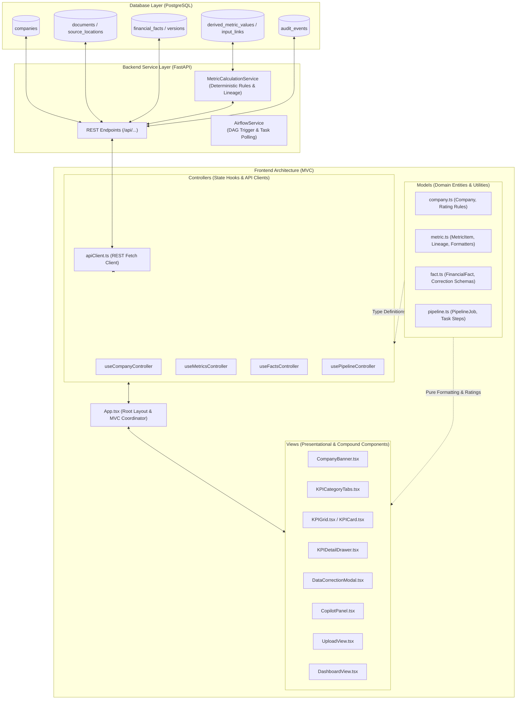
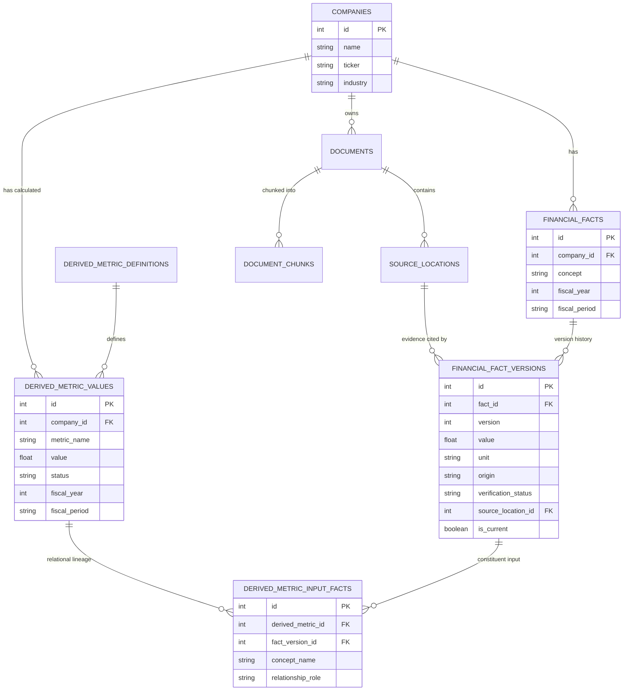
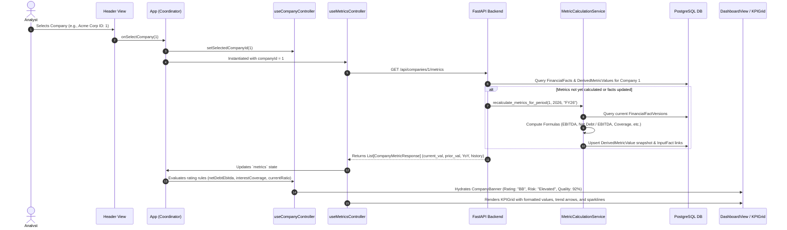
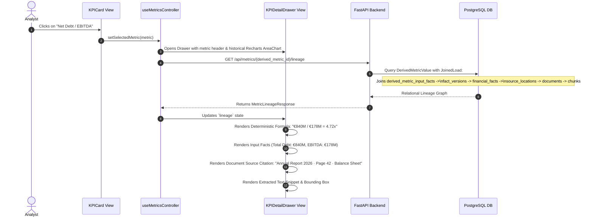
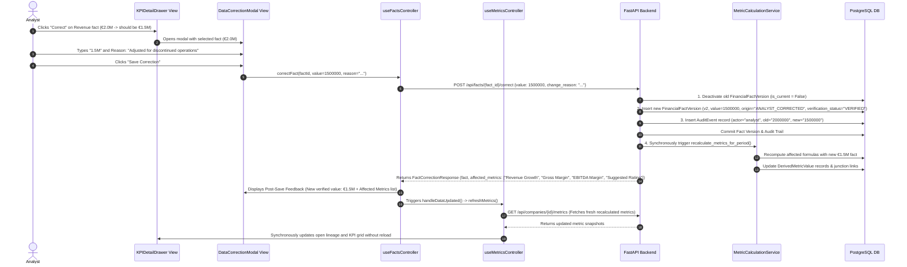
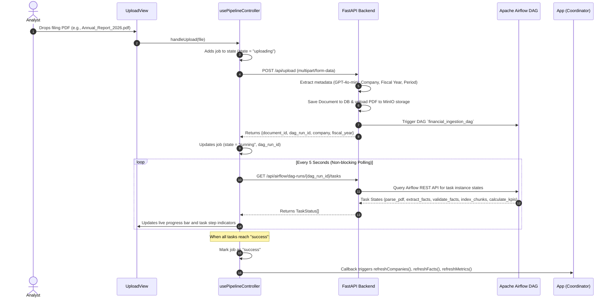
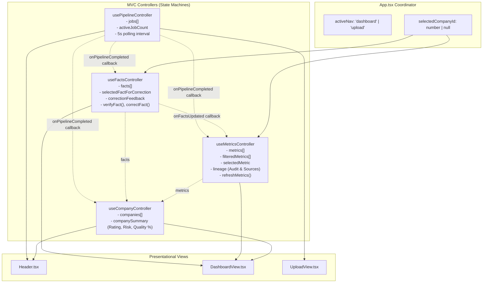

# Analyst Frontend Architecture & Data Flow Documentation

This document provides a comprehensive technical overview of the Analyst UI
frontend architecture, its **Model-View-Controller (MVC)** design pattern, its
relationship to the backend database schema, and detailed sequence diagrams for
every core logical workflow.

---

## 1. High-Level System Architecture

The application is structured as a decoupled full-stack platform:

- **Database Layer**: PostgreSQL storing relational entities (companies,
  filings, facts, versions, calculated metrics, audit trails, and vector
  embeddings).
- **Service & API Layer**: FastAPI exposing RESTful endpoints for metric
  calculation, fact mutations, evidence lineage, and Airflow orchestration.
- **Frontend Layer**: React 18 + TypeScript + TailwindCSS + Recharts, structured
  strictly around the **Model-View-Controller (MVC)** design pattern.



---

## 2. Database Schema to Frontend Model Mapping

The frontend models in [`apps/analyst_ui/src/models/`](./src/models) directly
reflect the database schema while decoupling presentation logic from raw table
structures.



### Mapping Table: Database to Frontend Types

| Database Table(s)                                                                | Backend REST Response                             | Frontend Model / Interface                                                                    | Purpose in UI                                                                                      |
| :------------------------------------------------------------------------------- | :------------------------------------------------ | :-------------------------------------------------------------------------------------------- | :------------------------------------------------------------------------------------------------- |
| `companies`, `financial_facts`                                                   | `CompanyResponse`, `CompanySummaryResponse`       | [`Company`](./src/models/company.ts), [`CompanySummary`](./src/models/company.ts)             | Header company switcher, credit rating badge (`BB`, `A`, `B`), verified data quality %.            |
| `derived_metric_values`, `derived_metric_definitions`                            | `CompanyMetricResponse`                           | [`MetricItem`](./src/models/metric.ts), [`MetricHistoryPoint`](./src/models/metric.ts)        | KPI cards, YoY deltas, category tabs, sparkline charts.                                            |
| `derived_metric_input_facts`, `source_locations`, `documents`, `document_chunks` | `MetricLineageResponse`                           | [`MetricLineage`](./src/models/metric.ts), [`MetricInputFactLineage`](./src/models/metric.ts) | KPI detail drawer: multi-year chart, formula breakdown, page/section source citations, RAG chunks. |
| `financial_facts`, `financial_fact_versions`                                     | `FinancialFactResponse`, `FactCorrectionResponse` | [`FinancialFact`](./src/models/fact.ts), [`FactCorrectionPayload`](./src/models/fact.ts)      | Data Correction Modal, analyst override audit justification, verified fact list.                   |

---

## 3. Low-Level Logical Workflows (Sequence Diagrams)

### Workflow 1: Initial Page Load & Dynamic KPI Hydration

When the analyst opens the application or selects a company from the top
navigation dropdown:



---

### Workflow 2: KPI Detail Inspection & Evidence Provenance

When an analyst clicks any KPI card on the dashboard to inspect the audit trail
and mathematical breakdown:



---

### Workflow 3: Fact Correction & Synchronous Recalculation

When an analyst identifies an incorrect AI-extracted fact and submits an
override with an audit reason:



---

### Workflow 4: Direct Fact Verification

When an analyst confirms that an AI-extracted fact matches the filing document:

```mermaid
sequenceDiagram
    autonumber
    actor Analyst
    participant Drawer as KPIDetailDrawer View
    participant C_Fact as useFactsController
    participant C_Metric as useMetricsController
    participant API as FastAPI Backend
    participant DB as PostgreSQL DB

    Analyst->>Drawer: Clicks "Verify" on fact (e.g., Total Debt)
    Drawer->>Drawer: Optimistically updates badge to "✓ Verified"
    Drawer->>C_Fact: onVerifyFact(factId)
    
    C_Fact->>API: POST /api/facts/{factId}/verify
    API->>DB: Update FinancialFactVersion (verification_status = "VERIFIED")
    API->>DB: Insert AuditEvent (action = "FACT_VERIFIED")
    API->>DB: Synchronous KPI recalculation & commit
    API-->>C_Fact: Returns updated FinancialFact
    
    C_Fact->>C_Metric: Triggers refreshMetrics()
    C_Metric->>Drawer: Re-fetches lineage; confirms verified state
```

---

### Workflow 5: Document Upload & Airflow Ingestion DAG

When an analyst uploads a new financial report PDF:



---

## 4. State Management Architecture in Frontend

All controllers are isolated custom React hooks acting as state machines. Their
coordination in [`App.tsx`](./src/App.tsx) maintains strict separation of
concerns:



---

## 5. Directory Structure Summary

```text
apps/analyst_ui/src/
├── models/
│   ├── company.ts             # Company interfaces, data quality, & credit rating evaluation rules
│   ├── metric.ts              # MetricItem, Lineage, Categories, formatMetricValue, parseAnalystInput
│   ├── fact.ts                # FinancialFact, FactCorrectionPayload, FactCorrectionResult
│   └── pipeline.ts            # PipelineJob, TaskStatus, TASK_STEPS definition
├── controllers/
│   ├── apiClient.ts           # Type-safe fetch wrapper with error boundary support
│   ├── useCompanyController.ts# Portfolio company state & underwriting risk scoring
│   ├── useMetricsController.ts# Dynamic metric fetching, category filtering & lineage retrieval
│   ├── useFactsController.ts  # Fact verification, correction overrides & affected metric feedback
│   └── usePipelineController.ts# Asynchronous filing upload & 5s Airflow DAG polling
├── views/
│   ├── components/
│   │   ├── Header.tsx         # Top bar with company switcher & active ingestion badge
│   │   ├── CompanyBanner.tsx  # Dynamic hero banner (Rating, Risk Level, Quality Score)
│   │   ├── KPICategoryTabs.tsx# Category navigation strip (Overview + 6 financial pillars)
│   │   ├── KPICard.tsx        # KPI card with sparklines, YoY directional badge, & formatted values
│   │   ├── KPIGrid.tsx        # Responsive grid layout with loading skeletons
│   │   ├── KPIDetailDrawer.tsx# Provenance drawer: Recharts trend, formula, and source citations
│   │   ├── DataCorrectionModal.tsx # Fact override modal with real business logic feedback
│   │   └── CopilotPanel.tsx   # Underwriting Copilot sidebar with context grounding
│   ├── DashboardView.tsx      # Main underwriting analysis workspace
│   └── UploadView.tsx         # Drag & drop filing upload and Airflow DAG progress monitor
├── App.tsx                    # Root layout & MVC coordinator
└── main.tsx                   # React 18 DOM mount point
```
