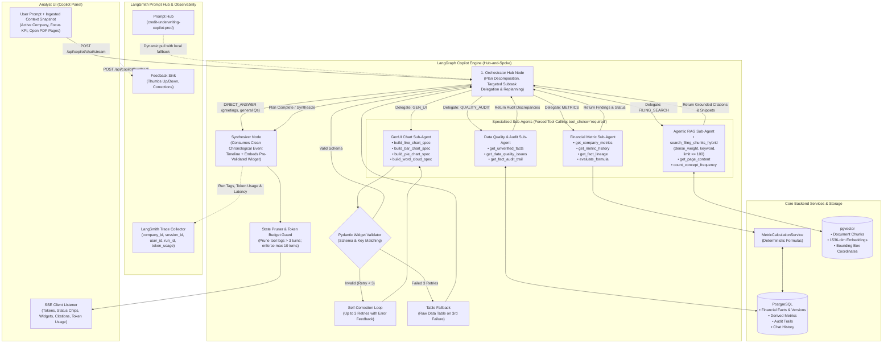
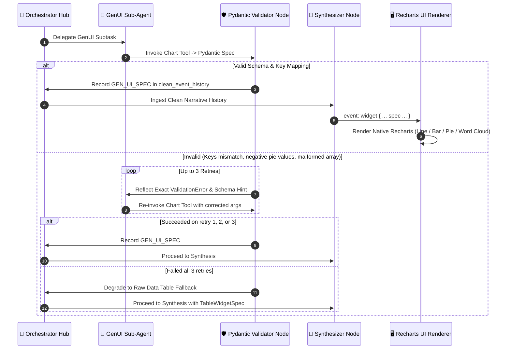
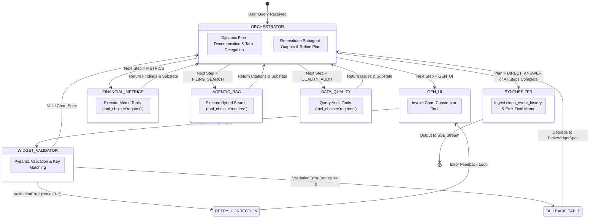

# Credit Underwriting Copilot: LangGraph Multi-Agent Engine

The **Credit Underwriting Copilot** is an enterprise AI assistant embedded directly inside the underwriting dashboard. It coordinates specialized sub-agents to compute deterministic financial KPIs, retrieve grounded filing evidence via Agentic Hybrid RAG, analyze accounting audit discrepancies, and synthesize interactive Generative UI chart widgets.

---

### 1. High-Level Multi-Agent Architecture

The engine uses a **Hub-and-Spoke Multi-Agent StateGraph** built with [LangGraph](https://github.com/langchain-ai/langgraph), traced end-to-end via **LangSmith**, and streamed over Server-Sent Events (SSE).



---

## 2. Core Architectural Pillars

### A. Centralized Hub-and-Spoke Architecture & Dynamic Task Delegation
The Underwriting Copilot implements a centralized **Hub-and-Spoke multi-agent topology**:
1. **Dynamic Initial Planning**: The Orchestrator uses structured output (`OrchestrationPlan`) to decompose complex analyst inquiries into ordered execution steps (`METRICS`, `FILING_SEARCH`, `QUALITY_AUDIT`, `GEN_UI`, `SYNTHESIZE`).
2. **Targeted Subtask Delegation**: Each subagent receives an isolated substate (`SubagentSubstate`) containing a tailored `task_description`, dedicated parameters, and scratchpad history. Subagents do not receive broad or irrelevant context.
3. **Hub Return & Dynamic Replanning**: All subagents report back directly to the Orchestrator Hub upon completion. The Orchestrator inspects the subagent's output, checks whether additional evidence is required, refines the plan if an output is incomplete or unexpected, and delegates the next step.
4. **Forced Tool Calling (`tool_choice="required"`)**: Every domain subagent is bound to its compartmentalized tool suite using `ChatOpenAI.bind_tools(tools, tool_choice="required")`, guaranteeing tool execution rather than speculative LLM arithmetic.

### B. Subagent Substate Isolation & Tool Error Recovery
Each subagent maintains an isolated substate in `CopilotGraphState`:
- **`metric_substate`**, **`rag_substate`**, **`audit_substate`**, and **`gen_ui_substate`**.
- Fields include `task_description`, `iteration_count`, `max_iterations`, `is_complete`, `tool_call_history`, `internal_messages`, and `final_summary`.
- **Self-Correction Feedback**: When a tool execution encounters an error (e.g. invalid metric name or malformed arguments), the subagent logs a `ToolCallRecord` with status `"ERROR"` and error details into its history. On subsequent iterations, the subagent reviews past failures to avoid repeating identical malformed calls.

### C. Clean Chronological Event Timeline (`clean_event_history`)
Instead of dumping raw SQL results, dense chunk lists, or verbose tool messages into the final synthesis prompt:
- A dedicated reducer `append_clean_events` maintains an append-only timeline of structured `CleanEvent` objects:
  - `USER_QUERY`: Original analyst prompt.
  - `ORCHESTRATOR_PLAN`: Formulated execution steps and reasoning.
  - `DELEGATED_TASK`: Specific subtask assigned to a subagent.
  - `SUBAGENT_ANSWER`: Synthesized domain findings from completed subagents.
  - `GEN_UI_SPEC`: Validated visualization widget metadata.
  - `PLAN_REFINED`: Plan adaptation notes during execution.
- The **Synthesizer Node** ingests this clean chronological narrative, seamlessly referencing the pre-validated GenUI widget and grounded citations without hallucinations or context window bloat.

### E. Agentic Hybrid RAG (pgvector + BM25 Full-Text)
The RAG tool gives the agent fine-grained control over retrieval mechanics:
- **Dynamic Dense/Keyword Weighting (`dense_weight: 0.0 to 1.0`)**:
  - `dense_weight = 1.0`: Pure semantic cosine vector retrieval (e.g., conceptual questions like *"What are the risks related to interest rate fluctuations?"*).
  - `dense_weight = 0.0`: Pure keyword matching via PostgreSQL full-text search / `tsvector` (e.g., exact debt covenants, indenture definitions, or ticker symbols).
  - `0.0 < dense_weight < 1.0`: Reciprocal Rank Fusion (RRF) combining vector and lexical rank.
- **Dynamic Retrieval Budget (`limit: 1 to 100`)**: The agent can choose to retrieve a small snippet set (3 chunks) for quick factual validation or up to 100 chunks for aggregate term frequency / word cloud analysis.
- **Strict Multi-Tenant Scoping**: `company_id` is automatically injected from graph state into all SQL/vector filters, preventing cross-tenant leakage.

### F. Grounded Evidence Provenance & Pydantic Citation Schema
Every factual assertion links back to the original source. When subagents retrieve facts or chunks, they construct structured `CitationSource` objects:

```python
class CitationSource(BaseModel):
    document_id: int
    filename: str
    page_number: int              # Physical PDF index (1-based)
    displayed_page: str           # Printed page label (e.g. "p. 42")
    section: Optional[str] = None # e.g. "Note 14: Long-Term Debt"
    snippet: Optional[str] = None # Verbatim cited excerpt
    bounding_box: Optional[List[float]] = None # [x0, top, x1, bottom] coordinates
    confidence_score: Optional[float] = None
    source_type: Literal["FILING_CHUNK", "STRUCTURED_FACT", "AUDIT_EVENT"]
```
All retrieved sources are registered in the graph state and streamed to the UI as a structured citations payload, enabling clickable deep-linking directly into the PDF preview drawer with yellow bounding box highlights.

### G. Generative UI Tool Binding with 3-Retry Self-Correction Loop
When visual charts or distributions are requested, the GenUI agent binds typed chart construction tools (`build_line_chart_spec`, `build_bar_chart_spec`, `build_pie_chart_spec`, `build_word_cloud_spec`) with `tool_choice="required"`. The returned specification is validated against strict Pydantic models:



### H. Conversation Token Budgeting, Pruning & Interruption
- **Intermediate Tool Log Pruning**: Intermediate tool outputs older than 3 conversation turns are stripped from the active prompt state, retaining only the synthesized assistant messages.
- **Maximum 10 Turns Hard Cap**: Sessions are capped at 10 user-assistant turns. When turn 10 is reached, the agent appends a notification instructing the analyst to start a new chat session to preserve reasoning accuracy.
- **FastAPI / Asyncio Cancellation**: When an analyst clicks **[Stop Generating]** in the UI or closes the drawer, the SSE abort signal triggers an `asyncio.CancelledError`, immediately halting the LangGraph execution loop and preventing unwanted API spend.

### I. LangSmith Prompt Hub Integration & Observability
- **Dynamic Prompt Pulling**: System prompts are pulled from LangSmith Prompt Hub (e.g. `copilot-orchestrator`, `copilot-financial-metric`, `copilot-rag`, `copilot-data-quality`, `copilot-gen-ui`, `copilot-synthesizer`) on startup with in-memory caching.
- **Local Fallback**: If LangSmith is unreachable or running offline, the engine falls back seamlessly to embedded local prompt constants.
- **Trace Metadata & Token Usage**: Every execution trace captures `company_id`, `session_id`, `user_id`, `active_metric`, and aggregated token details (`prompt_tokens`, `completion_tokens`, `cached_tokens`, `reasoning_tokens`, `total_tokens`).
- **Feedback Propagation**: Analyst thumbs up/down and fact correction events submitted via `POST /api/copilot/feedback` attach directly to the respective LangSmith run ID.

---

## 3. LangGraph State Machine Specification

### Graph State Schema (`state.py`)
```python
from typing import Annotated, List, Dict, Any, Optional, Literal
from typing_extensions import TypedDict
from langchain_core.messages import BaseMessage
from langgraph.graph.message import add_messages

class ToolCallRecord(TypedDict):
    tool_name: str
    arguments: Dict[str, Any]
    status: Literal["SUCCESS", "ERROR"]
    error_message: Optional[str]
    timestamp: float

class SubagentSubstate(TypedDict):
    task_description: str
    iteration_count: int
    max_iterations: int
    is_complete: bool
    tool_call_history: List[ToolCallRecord]
    internal_messages: List[BaseMessage]
    final_summary: Optional[str]

class CleanEvent(TypedDict):
    event_type: Literal["USER_QUERY", "ORCHESTRATOR_PLAN", "DELEGATED_TASK", "SUBAGENT_ANSWER", "GEN_UI_SPEC", "PLAN_REFINED"]
    agent: str
    content: str
    metadata: Optional[Dict[str, Any]]
    timestamp: float

class CopilotGraphState(TypedDict):
    # Core message history with LangGraph reducer
    messages: Annotated[List[BaseMessage], add_messages]
    clean_event_history: Annotated[List[CleanEvent], append_clean_events]

    # Session metadata & runtime context
    company_id: int
    session_id: str
    user_id: Optional[str]
    active_metric: Optional[str]
    context_snapshot: Dict[str, Any]

    # Orchestrator planning & execution state
    execution_plan: List[str]
    completed_steps: List[str]
    pending_parallel_tasks: List[str]
    current_step_index: int
    reasoning_status: Optional[str]

    # Isolated subagent substates
    metric_substate: Optional[SubagentSubstate]
    rag_substate: Optional[SubagentSubstate]
    audit_substate: Optional[SubagentSubstate]
    gen_ui_substate: Optional[SubagentSubstate]

    # Domain outputs & candidate widgets
    metric_results: Optional[Dict[str, Any]]
    rag_chunks: Optional[Dict[str, Any]]
    quality_issues: Optional[Dict[str, Any]]
    pending_widget: Optional[Dict[str, Any]]
    widget_validation_retries: int # 0 to 3
    widget_validation_error: Optional[str]

    # Grounded citations registry
    retrieved_sources: List[CitationSource]

    # Observability & token budgeting
    run_id: Optional[str]
    turn_count: int
    model_used: Optional[str]
    token_usage: Annotated[Dict[str, int], accumulate_tokens]
```

### Graph Node Routing & State Flow (Hub-and-Spoke)


---

## 4. Sub-Agent Tool Reference

### 1. `FinancialMetricAgent` Tools (`create_metric_tools(db)`)
| Tool | Signature | Description |
| :--- | :--- | :--- |
| `get_company_metrics` | `(company_id: int, fiscal_year: Optional[int]) -> Dict[str, Any]` | Fetches all 6 categories of credit metrics calculated deterministically via `MetricCalculationService`. |
| `get_metric_history` | `(company_id: int, metric_name: str) -> Dict[str, Any]` | Returns multi-year time-series data for trend and trajectory analysis. |
| `get_fact_lineage` | `(company_id: int, metric_name: str, fiscal_year: int) -> Dict[str, Any]` | Resolves constituent input facts, formula expressions, and exact PDF bounding box coordinates. |
| `evaluate_formula` | `(expression: str, variables: Dict[str, float]) -> Dict[str, Any]` | Deterministic Python arithmetic evaluator for ad-hoc formula simulation. |

### 2. `AgenticRAGAgent` Tools (`create_retrieval_tools(db)`)
| Tool | Signature | Description |
| :--- | :--- | :--- |
| `search_filing_chunks_hybrid` | `(query: str, company_id: int, fiscal_year: Optional[int], section_filter: Optional[str], dense_weight: float = 0.5, keyword_query: Optional[str] = None, limit: int = 5) -> Dict[str, Any]` | Performs hybrid dense vector (`pgvector`) + lexical BM25 search with reciprocal rank fusion. |
| `count_concept_frequency` | `(company_id: int, terms: List[str], document_id: Optional[int]) -> Dict[str, Any]` | Computes keyword occurrence counts across filings for word cloud distributions. |
| `get_page_content` | `(document_id: int, page_number: int) -> Dict[str, Any]` | Retrieves raw text and bounding boxes for a specific PDF page. |

### 3. `DataQualityAgent` Tools (`create_audit_tools(db)`)
| Tool | Signature | Description |
| :--- | :--- | :--- |
| `get_unverified_facts` | `(company_id: int) -> Dict[str, Any]` | Fetches facts with `verification_status = 'UNVERIFIED'`. |
| `get_data_quality_issues` | `(company_id: int) -> Dict[str, Any]` | Lists accounting reconciliation issues and prior-period restatement discrepancies. |
| `get_fact_audit_trail` | `(fact_id: int) -> Dict[str, Any]` | Returns complete bi-temporal modification history for a given fact. |

### 4. `GenUIWidgetAgent` Tools (`create_widget_tools()`)
| Tool | Signature | Supported Spec |
| :--- | :--- | :--- |
| `build_line_chart_spec` | `(title: str, series: List[Dict], data: List[Dict], description: Optional[str], unit: Optional[str])` | Generates a validated `LineChartSpec` for historical trajectories. |
| `build_bar_chart_spec` | `(title: str, series: List[Dict], data: List[Dict], description: Optional[str], unit: Optional[str])` | Generates a validated `BarChartSpec` for peer/category comparisons. |
| `build_pie_chart_spec` | `(title: str, data: List[Dict], description: Optional[str], unit: Optional[str])` | Generates a validated `PieChartSpec` for capital/liability breakdowns. |
| `build_word_cloud_spec` | `(title: str, word_cloud_data: List[Dict], description: Optional[str])` | Generates a validated `WordCloudSpec` for topical keyword frequencies. |

---

## 5. SSE Streaming Protocol & Event Schema

The stream endpoint is exposed at `POST /api/copilot/chat/stream`. It yields standard SSE event frames formatted as `event: <name>\ndata: <json>\n\n`.

### Event Types:

#### 1. Status Chip (`event: status`)
Emitted in real-time as the agent switches subagents or executes tools:
```json
{
  "step": "retrieval",
  "message": "Searching FY2025 Debt & Financing Schedule..."
}
```

#### 2. Trace ID Handshake (`event: trace`)
Emitted at the beginning of the run for feedback correlation:
```json
{
  "run_id": "9b1deb4d-3b7d-4bad-9bdd-2b0d7b3dcb6d"
}
```

#### 3. Text Token (`event: token` / `data: {"content": "..."}`)
Incremental stream of synthesized markdown text:
```json
{
  "content": "Net Debt to EBITDA increased from 3.10x in 2021 to 4.72x in 2025..."
}
```

#### 4. Generative UI Widget (`event: widget`)
Structured, Pydantic-validated chart or table payload:
```json
{
  "widgetType": "chart",
  "chartType": "line",
  "title": "5-Year Leverage vs EBITDA Margin",
  "description": "Historical credit trajectory (2021–2025)",
  "series": [
    { "key": "leverage", "label": "Net Debt / EBITDA (x)", "color": "#f43f5e" },
    { "key": "margin", "label": "EBITDA Margin (%)", "color": "#10b981" }
  ],
  "data": [
    { "year": "2021", "leverage": 3.1, "margin": 18.4 },
    { "year": "2025", "leverage": 4.72, "margin": 22.4 }
  ]
}
```

#### 5. Grounded Citations (`event: citations`)
Array of cited sources for evidence deep-linking:
```json
[
  {
    "documentId": 1,
    "filename": "FY2025_Annual_Report.pdf",
    "pageNumber": 87,
    "displayedPage": "p. 87",
    "section": "Note 18: Borrowings",
    "snippet": "Total senior notes outstanding increased to €1.20B.",
    "boundingBox": [100, 200, 500, 350]
  }
]
```

#### 6. Completion (`event: done`)
```json
{
  "sessionId": "session-1724256000",
  "messageId": "msg-asst-1724256050",
  "turnCount": 4,
  "maxTurns": 10
}
```

---

## 6. Directory Structure

```text
apps/api/src/api/copilot/
├── README.md                  # This architectural reference guide
├── agent.py                   # Underwriting Copilot agent interface
├── graph.py                   # LangGraph StateGraph assembly & compilation
├── state.py                   # CopilotGraphState & CitationSource schemas
├── prompts.py                 # LangSmith Prompt Hub loader & fallback templates
├── pruning.py                 # Message state reducer & token budgeting
├── nodes/
│   ├── orchestrator_node.py   # Decomposes plan, handles direct answers
│   ├── synthesizer_node.py    # Formats stream, links citations
│   └── widget_validator.py    # Pydantic chart validator with 3-retry loop & table fallback
├── schemas/
│   └── widget_schemas.py      # LineChart, BarChart, PieChart, WordCloud Pydantic specs
├── subagents/
│   ├── financial_metric_agent.py # Deterministic metric calculations
│   ├── rag_agent.py              # Agentic Hybrid RAG retrieval
│   ├── data_quality_agent.py     # Audit trail and discrepancy inspection
│   └── gen_ui_agent.py           # Recharts widget generation
└── tools/
    ├── metric_tools.py        # Python bindings to MetricCalculationService
    ├── retrieval_tools.py     # pgvector + fulltext hybrid retrieval tools
    ├── audit_tools.py         # Data quality & audit event tools
    └── widget_tools.py        # GenUI chart construction tools
```
