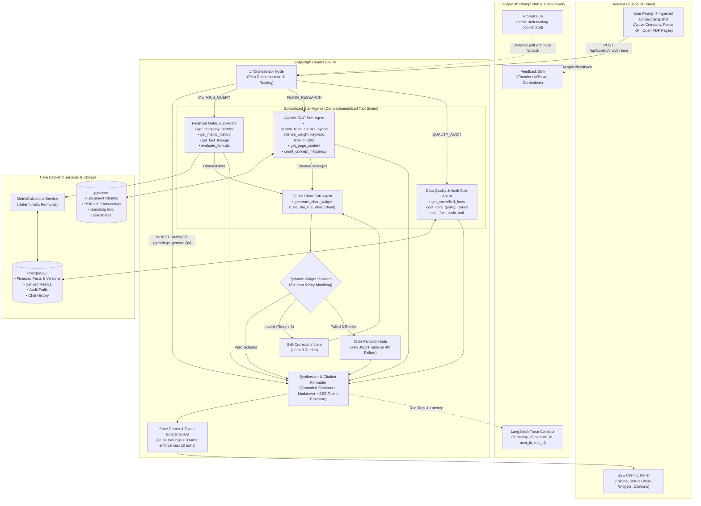
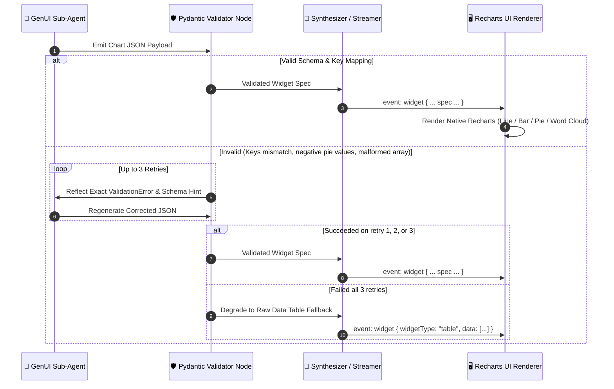
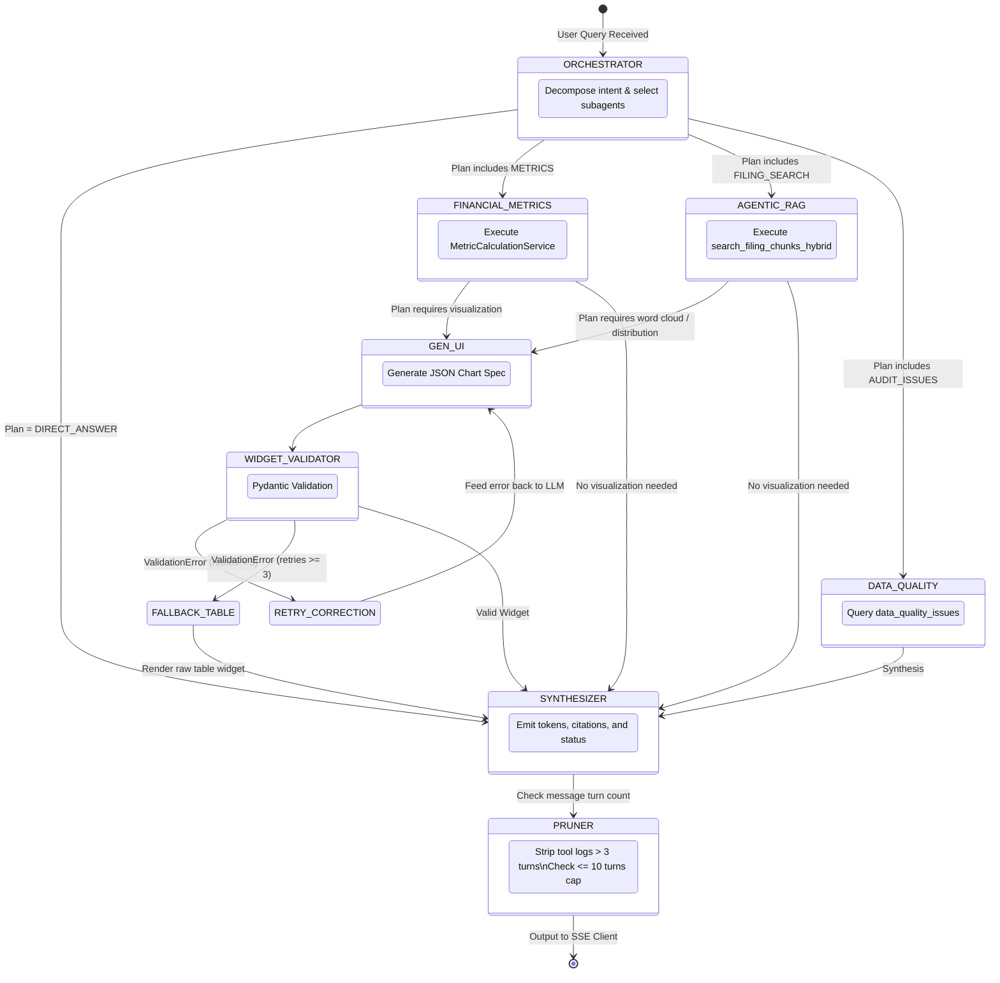

# Credit Underwriting Copilot: LangGraph Multi-Agent Engine

The **Credit Underwriting Copilot** is an enterprise AI assistant embedded directly inside the underwriting dashboard. It coordinates specialized sub-agents to compute deterministic financial KPIs, retrieve grounded filing evidence via Agentic Hybrid RAG, analyze accounting audit discrepancies, and synthesize interactive Generative UI chart widgets.

---

## 1. High-Level Multi-Agent Architecture

The engine uses an **Orchestrator-Subagent StateGraph** built with [LangGraph](https://github.com/langchain-ai/langgraph), traced end-to-end via **LangSmith**, and streamed over Server-Sent Events (SSE).



---

## 2. Core Architectural Pillars

### A. Orchestrator-Subagent Pattern & Anti-Tool Bloat
Instead of presenting a monolithic LLM with 10+ tool schemas simultaneously (which leads to tool overchoice, schema token waste, and hallucinated function calls):
1. **The Orchestrator** inspects the user query and UI context snapshot to determine whether to:
   - Formulate an immediate direct answer (`DIRECT_ANSWER`), or
   - Formulate an execution plan delegating to one or more specialized sub-agents.
2. **Specialized Sub-Agents** receive only the tools essential to their domain:
   - **`FinancialMetricAgent`**: Interacts exclusively with deterministic calculations and relational fact lineage.
   - **`AgenticRAGAgent`**: Interacts exclusively with hybrid vector search and document page inspection.
   - **`DataQualityAgent`**: Interacts exclusively with reconciliation issues and audit trails.
   - **`GenUIWidgetAgent`**: Interacts exclusively with structured visualization generation.

### B. Agentic Hybrid RAG (pgvector + BM25 Full-Text)
The RAG tool gives the agent fine-grained control over retrieval mechanics:
- **Dynamic Dense/Keyword Weighting (`dense_weight: 0.0 to 1.0`)**:
  - `dense_weight = 1.0`: Pure semantic cosine vector retrieval (e.g., conceptual questions like *"What are the risks related to interest rate fluctuations?"*).
  - `dense_weight = 0.0`: Pure keyword matching via PostgreSQL full-text search / `tsvector` (e.g., exact debt covenants, indenture definitions, or ticker symbols).
  - `0.0 < dense_weight < 1.0`: Reciprocal Rank Fusion (RRF) combining vector and lexical rank.
- **Dynamic Retrieval Budget (`limit: 1 to 100`)**: The agent can choose to retrieve a small snippet set (3 chunks) for quick factual validation or up to 100 chunks for aggregate term frequency / word cloud analysis.
- **Strict Multi-Tenant Scoping**: `company_id` is automatically injected from graph state into all SQL/vector filters, preventing cross-tenant leakage.

### C. Grounded Evidence Provenance & Pydantic Citation Schema
Every factual assertion links back to the original source. When subagents retrieve facts or chunks, they construct structured `CitationSource` objects:

```python
class CitationSource(BaseModel):
    document_id: int
    filename: str
    page_number: int              # Physical PDF index (1-based)
    displayed_page: str           # Printed page label (e.g. "p. 42")
    section: Optional[str] = None # e.g. "Note 14: Long-Term Debt"
    snippet: Optional[str] = None # Verbatim cited excerpt
    bounding_box: Optional[List[float]] = None # [x0, top, x1, bottom] coordinates
    confidence_score: Optional[float] = None
    source_type: Literal["FILING_CHUNK", "STRUCTURED_FACT", "AUDIT_EVENT"]
```
All retrieved sources are registered in the graph state and streamed to the UI as a structured citations payload, enabling clickable deep-linking directly into the PDF preview drawer with yellow bounding box highlights.

### D. Generative UI Widget Engine with 3-Retry Self-Correction Loop
When visual charts or distributions are requested, the agent generates structured JSON matching the `ChartWidgetPayload` schema:



### E. Conversation Token Budgeting, Pruning & Interruption
- **Intermediate Tool Log Pruning**: Intermediate tool outputs older than 3 conversation turns are stripped from the active prompt state, retaining only the synthesized assistant messages.
- **Maximum 10 Turns Hard Cap**: Sessions are capped at 10 user-assistant turns. When turn 10 is reached, the agent appends a notification instructing the analyst to start a new chat session to preserve reasoning accuracy.
- **FastAPI / Asyncio Cancellation**: When an analyst clicks **[Stop Generating]** in the UI or closes the drawer, the SSE abort signal triggers an `asyncio.CancelledError`, immediately halting the LangGraph execution loop and preventing unwanted API spend.

### F. LangSmith Prompt Hub Integration & Observability
- **Dynamic Prompt Pulling**: System prompts are pulled from LangSmith Prompt Hub (e.g. `credit-underwriting-copilot:v1.2`) on startup with in-memory caching.
- **Local Fallback**: If LangSmith is unreachable or running offline, the engine falls back seamlessly to embedded local prompt constants.
- **Trace Metadata**: Every execution trace is tagged with:
  ```json
  {
    "company_id": 1,
    "session_id": "session-1724256000",
    "user_id": "analyst-42",
    "active_metric": "net_debt_to_ebitda",
    "model": "gpt-4o-mini"
  }
  ```
- **Feedback Propagation**: Analyst thumbs up/down and fact correction events submitted via `POST /api/copilot/feedback` attach directly to the respective LangSmith run ID.

---

## 3. LangGraph State Machine Specification

### Graph State Schema (`state.py`)
```python
from typing import Annotated, List, Dict, Any, Optional, Literal
from typing_extensions import TypedDict
from langchain_core.messages import BaseMessage
from langgraph.graph.message import add_messages

class CopilotGraphState(TypedDict):
    # Core message history with LangGraph reducer
    messages: Annotated[List[BaseMessage], add_messages]

    # Session metadata & runtime context
    company_id: int
    session_id: str
    user_id: Optional[str]
    active_metric: Optional[str]
    context_snapshot: Dict[str, Any]

    # Orchestrator planning
    execution_plan: List[str]
    current_step: int
    reasoning_status: Optional[str]

    # Intermediate subagent results
    metric_results: Optional[Dict[str, Any]]
    rag_chunks: Optional[List[Dict[str, Any]]]
    quality_issues: Optional[List[Dict[str, Any]]]

    # Generative UI widget validation state
    pending_widget: Optional[Dict[str, Any]]
    widget_validation_retries: int # 0 to 3

    # Grounded citations registry
    retrieved_sources: List[CitationSource]

    # Observability
    run_id: Optional[str]
```

### Graph Node Routing & State Flow


---

## 4. Sub-Agent Tool Reference

### 1. `FinancialMetricAgent` Tools (`metric_tools.py`)
| Tool | Signature | Description |
| :--- | :--- | :--- |
| `get_company_metrics` | `(company_id: int, fiscal_year: Optional[int]) -> List[MetricValue]` | Fetches all 6 categories of credit metrics calculated deterministically via `MetricCalculationService`. |
| `get_metric_history` | `(company_id: int, metric_name: str) -> List[HistoricalPoint]` | Returns multi-year time-series data for trend and trajectory analysis. |
| `get_fact_lineage` | `(company_id: int, metric_name: str, fiscal_year: int) -> MetricLineage` | Resolves constituent input facts, formula expressions, and exact PDF bounding box coordinates. |
| `evaluate_formula` | `(expression: str, variables: Dict[str, float]) -> CalculationResult` | Deterministic Python arithmetic evaluator for ad-hoc formula simulation. |

### 2. `AgenticRAGAgent` Tools (`retrieval_tools.py`)
| Tool | Signature | Description |
| :--- | :--- | :--- |
| `search_filing_chunks_hybrid` | `(query: str, company_id: int, fiscal_year: Optional[int], section_filter: Optional[str], dense_weight: float = 0.5, keyword_query: Optional[str] = None, limit: int = 5) -> List[GroundedChunkResult]` | Performs hybrid dense vector (`pgvector`) + lexical BM25 search. Allows agent-tunable dense weighting and dynamic retrieval limit (1 to 100). |
| `count_concept_frequency` | `(company_id: int, terms: List[str], document_id: Optional[int]) -> Dict[str, int]` | Computes keyword occurrence counts across filings for word cloud distributions. |
| `get_page_content` | `(document_id: int, page_number: int) -> PageDetails` | Retrieves raw text and bounding boxes for a specific PDF page. |

### 3. `DataQualityAgent` Tools (`audit_tools.py`)
| Tool | Signature | Description |
| :--- | :--- | :--- |
| `get_unverified_facts` | `(company_id: int) -> List[UnverifiedFact]` | Fetches facts with `verification_status = 'UNVERIFIED'`. |
| `get_data_quality_issues` | `(company_id: int) -> List[QualityIssue]` | Lists accounting reconciliation issues and prior-period restatement discrepancies. |
| `get_fact_audit_trail` | `(fact_id: int) -> List[AuditEvent]` | Returns complete bi-temporal modification history for a given fact. |

### 4. `GenUIWidgetAgent` Tools (`widget_tools.py`)
| Tool | Supported Widget Types | Description |
| :--- | :--- | :--- |
| `generate_chart_widget` | `line`, `bar`, `pie`, `word_cloud` | Generates a structured JSON visualization payload validated by Pydantic against frontend Recharts specifications. |

---

## 5. SSE Streaming Protocol & Event Schema

The stream endpoint is exposed at `POST /api/copilot/chat/stream`. It yields standard SSE event frames formatted as `event: <name>\ndata: <json>\n\n`.

### Event Types:

#### 1. Status Chip (`event: status`)
Emitted in real-time as the agent switches subagents or executes tools:
```json
{
  "step": "retrieval",
  "message": "Searching FY2025 Debt & Financing Schedule..."
}
```

#### 2. Trace ID Handshake (`event: trace`)
Emitted at the beginning of the run for feedback correlation:
```json
{
  "run_id": "9b1deb4d-3b7d-4bad-9bdd-2b0d7b3dcb6d"
}
```

#### 3. Text Token (`event: token` / `data: {"content": "..."}`)
Incremental stream of synthesized markdown text:
```json
{
  "content": "Net Debt to EBITDA increased from 3.10x in 2021 to 4.72x in 2025..."
}
```

#### 4. Generative UI Widget (`event: widget`)
Structured, Pydantic-validated chart or table payload:
```json
{
  "widgetType": "chart",
  "chartType": "line",
  "title": "5-Year Leverage vs EBITDA Margin",
  "description": "Historical credit trajectory (2021–2025)",
  "series": [
    { "key": "leverage", "label": "Net Debt / EBITDA (x)", "color": "#f43f5e" },
    { "key": "margin", "label": "EBITDA Margin (%)", "color": "#10b981" }
  ],
  "data": [
    { "year": "2021", "leverage": 3.1, "margin": 18.4 },
    { "year": "2025", "leverage": 4.72, "margin": 22.4 }
  ]
}
```

#### 5. Grounded Citations (`event: citations`)
Array of cited sources for evidence deep-linking:
```json
[
  {
    "documentId": 1,
    "filename": "FY2025_Annual_Report.pdf",
    "pageNumber": 87,
    "displayedPage": "p. 87",
    "section": "Note 18: Borrowings",
    "snippet": "Total senior notes outstanding increased to €1.20B.",
    "boundingBox": [100, 200, 500, 350]
  }
]
```

#### 6. Completion (`event: done`)
```json
{
  "sessionId": "session-1724256000",
  "messageId": "msg-asst-1724256050",
  "turnCount": 4,
  "maxTurns": 10
}
```

---

## 6. Directory Structure

```text
apps/api/src/api/copilot/
├── README.md                  # This architectural reference guide
├── agent.py                   # Underwriting Copilot agent interface
├── graph.py                   # LangGraph StateGraph assembly & compilation
├── state.py                   # CopilotGraphState & CitationSource schemas
├── prompts.py                 # LangSmith Prompt Hub loader & fallback templates
├── pruning.py                 # Message state reducer & token budgeting
├── nodes/
│   ├── orchestrator_node.py   # Decomposes plan, handles direct answers
│   ├── synthesizer_node.py    # Formats stream, links citations
│   └── widget_validator.py    # Pydantic chart validator with 3-retry loop & table fallback
├── schemas/
│   └── widget_schemas.py      # LineChart, BarChart, PieChart, WordCloud Pydantic specs
├── subagents/
│   ├── financial_metric_agent.py # Deterministic metric calculations
│   ├── rag_agent.py              # Agentic Hybrid RAG retrieval
│   ├── data_quality_agent.py     # Audit trail and discrepancy inspection
│   └── gen_ui_agent.py           # Recharts widget generation
└── tools/
    ├── metric_tools.py        # Python bindings to MetricCalculationService
    ├── retrieval_tools.py     # pgvector + fulltext hybrid retrieval tools
    ├── audit_tools.py         # Data quality & audit event tools
    └── widget_tools.py        # GenUI chart construction tools
```
