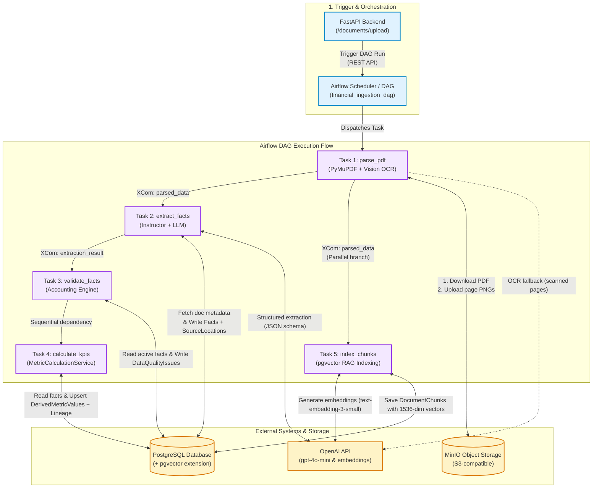
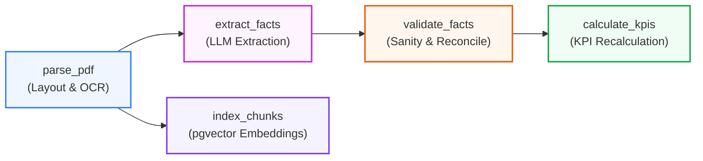
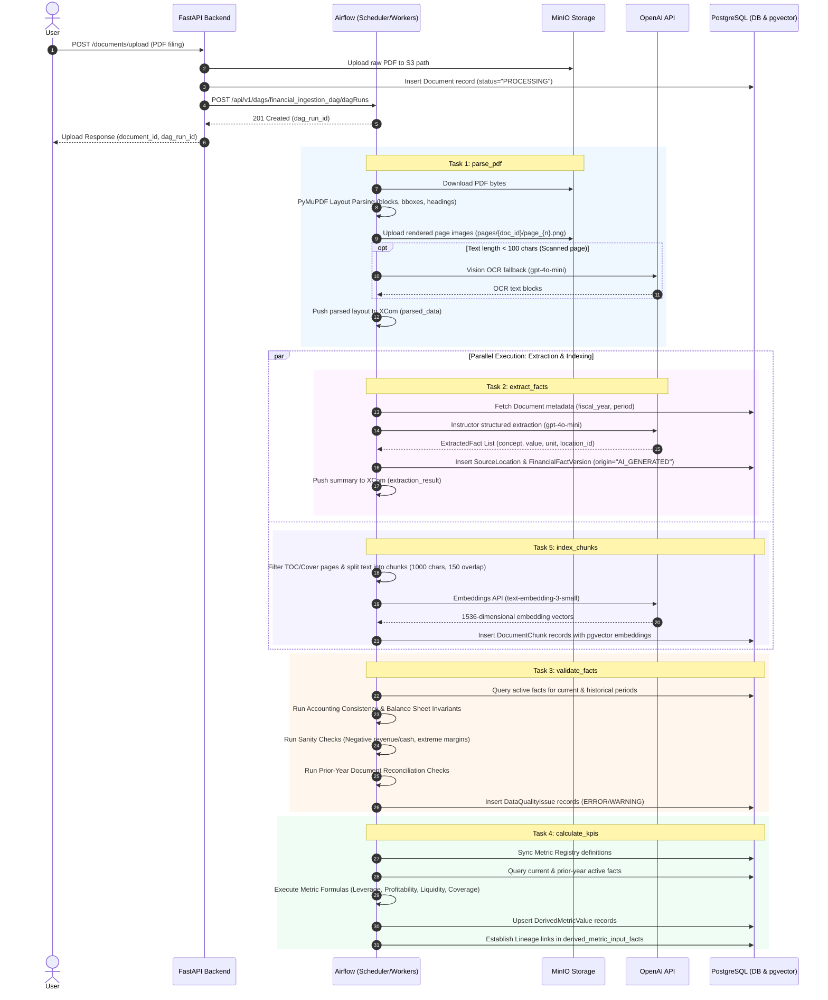

# Financial Ingestion Pipeline (`financial_ingestion_dag`)

This directory houses the Apache Airflow data ingestion and processing pipelines
for the AI-Assisted Credit Underwriting platform. The primary workflow is
defined in
[`dags/financial_ingestion_dag.py`](./dags/financial_ingestion_dag.py),
orchestrating the end-to-end ingestion of corporate financial filings (PDFs),
structured fact extraction, accounting validation, semantic vector chunking, and
derived KPI metric calculation.

---

## 1. High-Level System Architecture & DAG Mapping

The diagram below illustrates how each task in `financial_ingestion_dag`
interacts with external components (MinIO, OpenAI API, PostgreSQL / pgvector)
and executes core business logic.



---

## 2. DAG Topology & Dependency Graph



- **Branch A (Structured Ledger Pipeline)**: `parse_pdf` &rarr; `extract_facts`
  &rarr; `validate_facts` &rarr; `calculate_kpis`
- **Branch B (Unstructured Semantic Search Pipeline)**: `parse_pdf` &rarr;
  `index_chunks` (executes in parallel with Branch A).

---

## 3. End-to-End Execution Sequence Diagram



---

## 4. Detailed Task Business Logic

### Task 1: `parse_pdf`

- **Source Module**: [`tasks/parsing.py`](./tasks/parsing.py)
- **Trigger Input (`dag_run.conf`)**:
  - `document_id`: Integer ID of the uploaded filing.
  - `company_id`: Integer ID of the company.
  - `s3_path`: MinIO path where the raw PDF is stored.
- **Core Logic**:
  1. **PDF Download**: Fetches PDF binary stream from MinIO via
     `StorageService.download_file`.
  2. **Page-by-Page Rendering**: Converts each page to a 150 DPI PNG image and
     uploads it to MinIO (`pages/{document_id}/page_{page_num}.png`) for the
     frontend interactive PDF viewer.
  3. **Text & Layout Extraction**: Extracts text blocks with bounding boxes
     `(x0, y0, x1, y1)` using PyMuPDF (`fitz`).
  4. **Noise Filtering**: Automatically removes running headers and footers by
     ignoring content in the top 5% (`y0 < height * 0.05`) and bottom 5%
     (`y1 > height * 0.95`).
  5. **Displayed Page Number Extraction**: Regex scans bottom 10% for Roman
     numerals or printed page digits (e.g., `Page 12`, `iv`).
  6. **Heading & Section Path Tracking**: Detects section markers (`Item 1`,
     `Part II`, `Note 3`) and bold/larger fonts to build a hierarchical
     breadcrumb (`Item 1. Business > Financial Statements`).
  7. **OCR Fallback**: If a page contains `< 100` selectable characters (scanned
     / image PDF), base64 encodes the page image and calls OpenAI Vision
     (`gpt-4o-mini`) to extract textual blocks.
- **Task Output (XCom)**:
  ```json
  {
    "document_id": 1,
    "company_id": 1,
    "pages": [
      {
        "page_number": 1,
        "displayed_page_number": "1",
        "section_path": "Item 8. Financial Statements > Note 1",
        "blocks": [
          {
            "id": "p1_b0",
            "text": "Total Revenue was $1,250M...",
            "bbox": [54.0, 120.5, 500.0, 140.0]
          }
        ]
      }
    ]
  }
  ```

---

### Task 2: `extract_facts`

- **Source Module**: [`tasks/extraction.py`](./tasks/extraction.py)
- **Core Logic**:
  1. **Document Context**: Retrieves `fiscal_year` and `fiscal_period` from the
     `Document` database record.
  2. **Prompt Assembly**: Formats extracted text blocks annotated with
     `[Block ID: px_by]` and `[Section: ...]`.
  3. **Structured LLM Extraction**: Uses `instructor` with OpenAI `gpt-4o-mini`
     and Pydantic schemas (`ExtractedFactsList`) to extract canonical financial
     concepts:
     - _Canonical Concepts_: `Revenue`, `Cost of Goods Sold`, `Gross Profit`,
       `Operating Income`, `EBITDA`, `Net Income`, `Total Debt`, `Cash`,
       `Current Assets`, `Current Liabilities`, `Total Equity`,
       `Operating Cash Flow`, `Capital Expenditures`, `Total Assets`,
       `Total Liabilities`, `Interest Expense`, `Short-term Debt`,
       `Long-term Debt`, `Working Capital`, `Free Cash Flow`.
     - Scales units automatically (e.g., converts `"$1.2B"` to `1200000000.0`).
  4. **Database Persistence & Versioning**:
     - **`SourceLocation`**: Saves exact bounding box, page number, section
       breadcrumb, and SHA-256 hash of text snippet.
     - **`FinancialFact`**: Maps
       `(company_id, concept, fiscal_year, fiscal_period)`.
     - **`FinancialFactVersion`**: Deactivates older active versions
       (`is_current = False`), increments `version`, sets
       `origin = "AI_GENERATED"`, `verification_status = "UNVERIFIED"`, and
       links to the `SourceLocation`.
- **Task Output (XCom)**:
  ```json
  {
    "document_id": 1,
    "company_id": 1,
    "fiscal_year": 2025,
    "fiscal_period": "FY",
    "fact_ids": [101, 102, 103, 104]
  }
  ```

---

### Task 3: `validate_facts`

- **Source Module**: [`tasks/validation.py`](./tasks/validation.py)
- **Core Logic**:
  1. **Fetches Active Facts**: Loads all current `FinancialFactVersion` records
     for the company across target and historical periods.
  2. **Mathematical Consistency Checks (Accounting Rules)**:
     - $\text{Gross Profit} \equiv \text{Revenue} - \text{COGS}$
     - $\text{Operating Income} \equiv \text{Gross Profit} - \text{Operating Expense}$
     - $\text{Total Assets} \equiv \text{Total Liabilities} + \text{Total Equity}$
     - $\text{Free Cash Flow} \equiv \text{Operating Cash Flow} - \text{Capital Expenditures}$
     - $\text{Total Debt} \equiv \text{Short-term Debt} + \text{Long-term Debt}$
     - $\text{Working Capital} \equiv \text{Current Assets} - \text{Current Liabilities}$
     - _Tolerance_: Any discrepancy $> 1.0$ generates a `DataQualityIssue`
       (`severity="ERROR"`, `issue_type="ACCOUNTING_RULE_VIOLATION"`).
  3. **Financial Sanity Checks**:
     - Flags negative Revenue, negative Cash, negative Total Assets, or negative
       Total Debt (`severity="WARNING"`, `issue_type="SANITY_CHECK_WARNING"`).
     - Validates Gross Margin $\in [-100\%, 100\%]$.
  4. **Prior-Year Reconciliation Checks**:
     - Compares reported prior-year numbers in the current document against
       historical documents already registered in the workstation. Discrepancies
       generate `issue_type="RECONCILIATION_DISCREPANCY"`.

---

### Task 4: `calculate_kpis`

- **Source Module**:
  [`apps/api/src/api/services/metric_calculation.py`](/apps/api/src/api/services/metric_calculation.py)
- **Core Logic**:
  1. **Registry Synchronization**: Synchronizes formulas and definitions from
     [`METRIC_REGISTRY`](/apps/api/src/api/core/metric_registry.py) into
     `derived_metric_definitions`.
  2. **Fact Aggregation**: Assembles current and prior-year normalized facts
     into calculation vectors.
  3. **Deterministic Metric Computations**:
     - **Profitability**: Gross Margin, EBITDA Margin, Operating Margin, Net
       Profit Margin.
     - **Leverage & Debt**: Total Debt, Net Debt, Debt-to-EBITDA, Net
       Debt-to-EBITDA, Debt-to-Capital.
     - **Liquidity**: Current Ratio, Quick Ratio, Cash Ratio, Working Capital.
     - **Coverage & Cash Flow**: EBITDA-to-Interest, EBIT-to-Interest,
       FCF-to-Debt, Cash Flow-to-Interest.
     - **Growth**: YoY Revenue Growth (compares with $FY_{t-1}$).
  4. **Relational Lineage Tracking**:
     - Upserts snapshot values into `derived_metric_values`.
     - Populates `derived_metric_input_facts` with exact references to the
       `FinancialFactVersion` records and input roles (`INPUT`, `PRIOR_PERIOD`,
       `SHORT_TERM_DEBT`, etc.), enabling zero-duplication audit trails and
       click-to-source UI navigation.

---

### Task 5: `index_chunks` (Parallel Branch)

- **Source Module**: [`tasks/indexing.py`](./tasks/indexing.py)
- **Core Logic**:
  1. **Irrelevant Page Filtering**: Skips Tables of Contents and Cover pages
     using heuristic pattern matching.
  2. **Sliding-Window Chunking**: Chunks text into 1,000-character segments with
     150-character overlap.
  3. **Section Path Annotation**: Prepends section breadcrumbs
     (`Section: Item 8 > Note 1...`) to prevent embedding semantic drift.
  4. **Concept & Metric Tagging**: Identifies mentioned financial concepts and
     tags affected metrics in `chunk_metadata`.
  5. **Vector Embedding**: Calls OpenAI `text-embedding-3-small` (1536
     dimensions).
  6. **Vector Store Persistence**: Inserts into `document_chunks` table
     utilizing PostgreSQL `pgvector` for semantic search and RAG citations.

---

## 5. DAG Configuration & Environment Variables

| Variable                              | Description                                               | Default / Example               |
| :------------------------------------ | :-------------------------------------------------------- | :------------------------------ |
| `AIRFLOW_URL`                         | Base URL of Airflow webserver                             | `http://airflow-webserver:8080` |
| `OPENAI_API_KEY`                      | OpenAI API key for OCR, extraction, and embeddings        | `sk-...`                        |
| `POSTGRES_USER` / `POSTGRES_PASSWORD` | PostgreSQL credentials                                    | `underwriter` / `...`           |
| `POSTGRES_DB`                         | Application database with pgvector extension              | `credit_underwriting`           |
| `MINIO_ENDPOINT`                      | MinIO S3 endpoint                                         | `minio:9000`                    |
| `MINIO_BUCKET_NAME`                   | Storage bucket for uploaded PDFs and rendered page images | `financial-documents`           |

---

## 6. Running & Testing Pipelines Locally

### Triggering via Airflow CLI (Inside Docker container)

```bash
docker exec -it airflow-webserver airflow dags trigger financial_ingestion_dag \
  --conf '{"document_id": 1, "company_id": 1, "s3_path": "uploads/company_1/doc_1.pdf"}'
```

### Running Pipeline Unit Tests

```bash
# Run task test suite
pytest apps/pipelines/tests/
```
